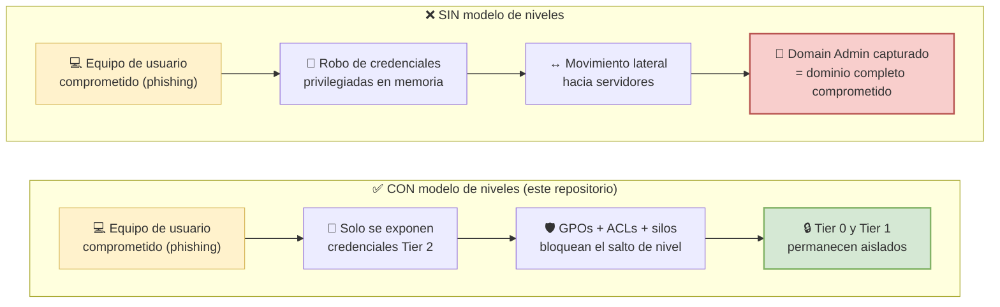
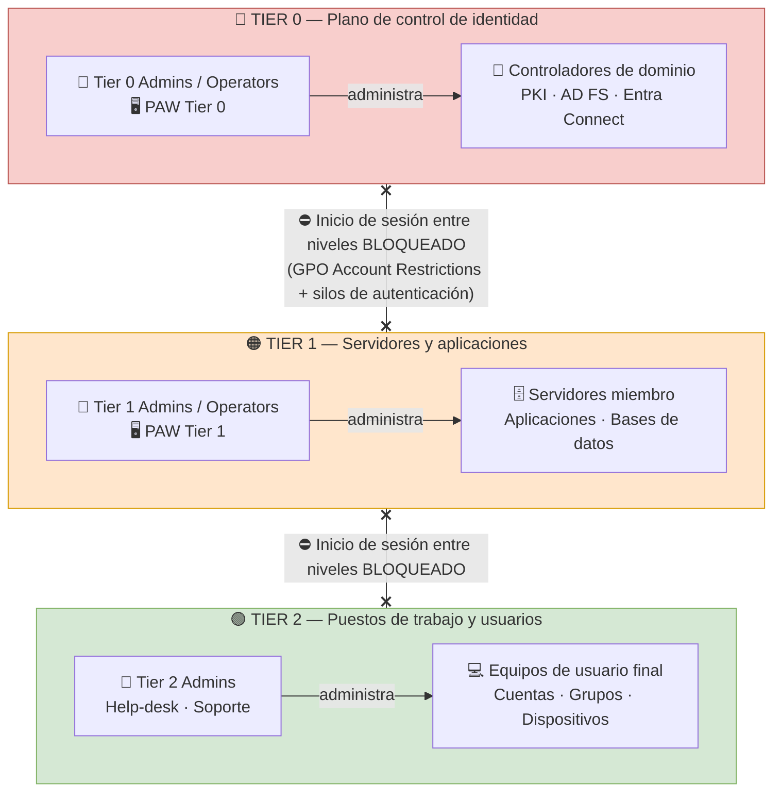
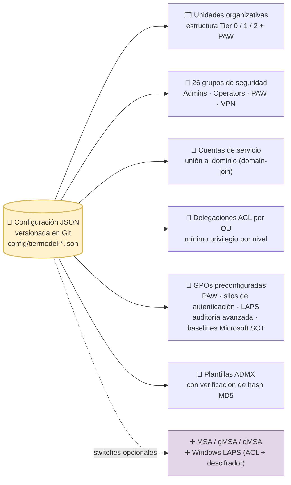
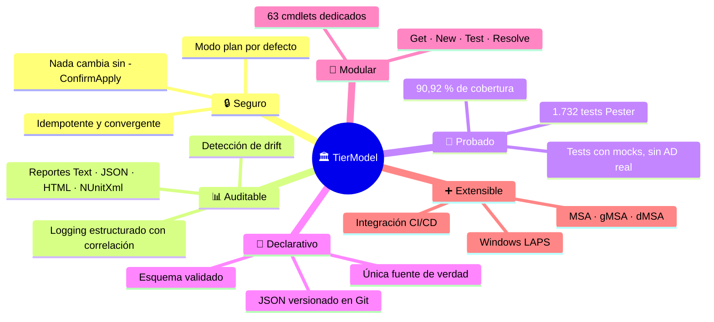
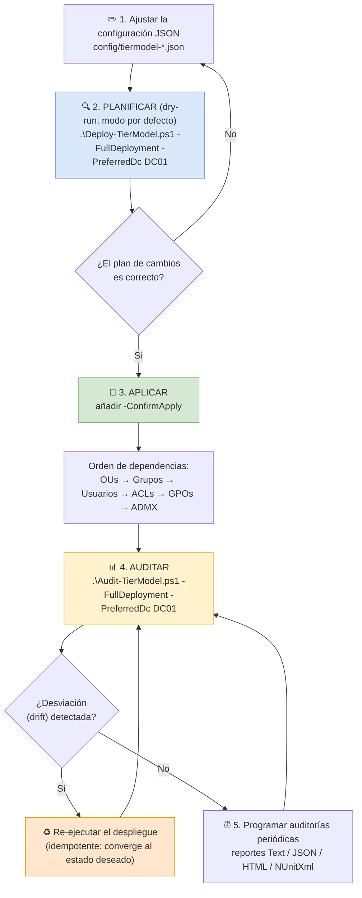
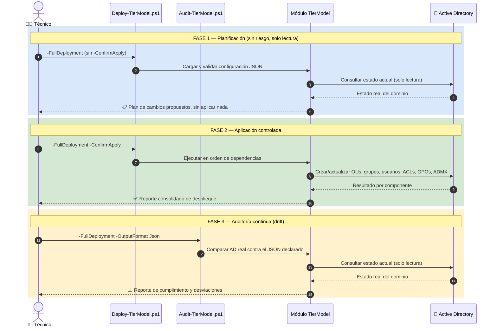
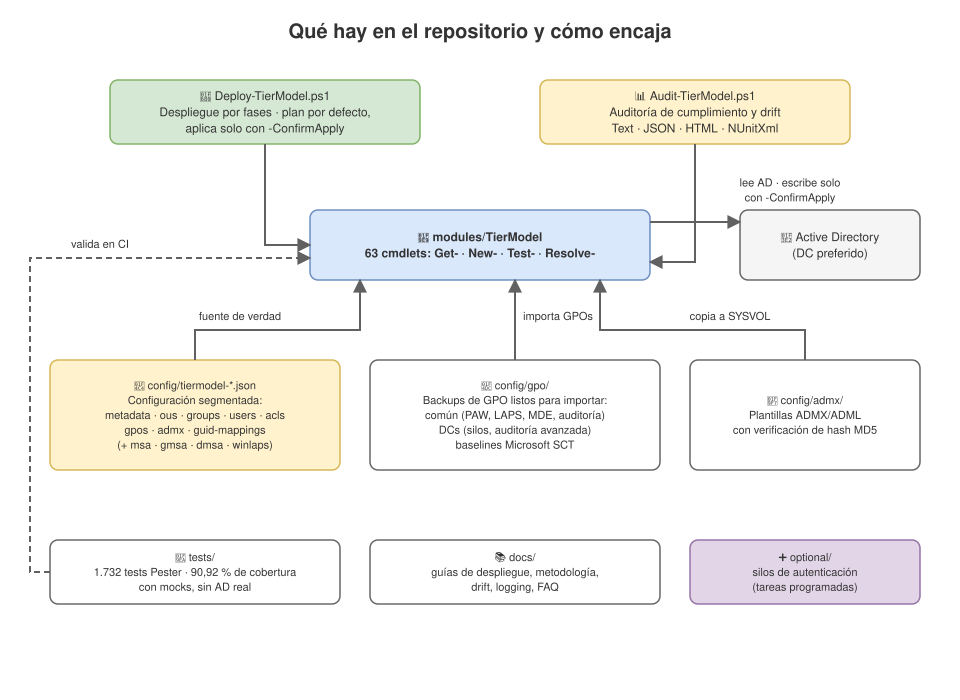

# 🏛️ Tier Model: Modelo de Niveles para Active Directory

> 🌐 **Idioma / Language**: 🇪🇸 Español (este documento) | 🇬🇧 [English](README_ENG.md)

Framework declarativo en PowerShell para **desplegar y auditar un Modelo de Niveles (Tier Model) de Active Directory** (OUs, grupos, usuarios, delegaciones ACL, GPOs, plantillas ADMX, permisos MSA/gMSA/dMSA y permisos de Windows LAPS) a partir de una configuración JSON única y versionada en Git. Se puede re-ejecutar las veces que haga falta (es idempotente), detecta desviaciones (*drift*) y da resultados reproducibles porque las versiones de las dependencias están fijadas.

> 🏗️ **Construido con el framework Specify**: desarrollo guiado por pruebas (TDD) que garantiza calidad y fiabilidad

---

## ⚡ En dos minutos: por qué, para qué y cómo

| Pregunta | Respuesta corta |
|----------|-----------------|
| **¿Por qué?** | El robo de credenciales y el movimiento lateral convierten un equipo de usuario comprometido en un dominio completo comprometido. El modelo de niveles aísla las credenciales administrativas por capas y corta esa cadena de ataque. |
| **¿Para qué?** | Para desplegar toda la estructura del modelo en minutos y de forma repetible: OUs, grupos, cuentas de servicio, delegaciones ACL, GPOs endurecidas y plantillas ADMX. Y para comprobar después, cuando haga falta, que nada se desvió de lo declarado. |
| **¿Cómo?** | 1️⃣ Planificar (*dry-run*, sin riesgo) → 2️⃣ Aplicar con `-ConfirmApply` → 3️⃣ Auditar y programar auditorías periódicas. Todo desde 2 scripts: `Deploy-TierModel.ps1` y `Audit-TierModel.ps1`. |

---

## 🤔 ¿Por qué existe esto?

En un dominio "plano", cualquier administrador puede iniciar sesión en cualquier equipo. Basta comprometer **un** puesto de trabajo donde un Domain Admin haya iniciado sesión para robar sus credenciales de la memoria y escalar hasta controlar todo el dominio. El modelo de niveles de Microsoft (hoy *Enterprise Access Model*) rompe esa cadena separando la administración en tres capas estancas:



### La arquitectura de niveles que despliega este repositorio

Cada nivel tiene sus propios administradores, sus propias estaciones de administración (PAW) y sus propias GPOs de restricción de cuentas. Las credenciales de un nivel **nunca** tocan un equipo de otro nivel:



Montar esto a mano significa crear decenas de OUs, 26 grupos, delegaciones ACL objeto por objeto y docenas de GPOs. Es lento, se presta a errores y después nadie puede verificar con confianza que sigue bien configurado. Este repositorio automatiza todo el proceso y permite auditarlo en cualquier momento.

---

## 🎯 ¿Para qué sirve? Qué despliega exactamente

Toda la configuración vive en archivos JSON versionados (`config/tiermodel-*.json`): la única fuente de verdad. A partir de ella, el despliegue crea y mantiene:



Las GPOs incluidas vienen como copias de seguridad listas para importar: restricciones de cuentas por nivel, endurecimiento de PAW (AppLocker, BitLocker, acceso a Internet), silos de autenticación para Tier 0, política de auditoría avanzada para DCs, Windows LAPS, etiquetas MDE por nivel, auditoría de PowerShell y las *security baselines* oficiales de Microsoft (SCT) para Windows 11, Windows Server 2025, Microsoft 365 Apps e Internet Explorer 11.

---

## 🏆 Ventajas



En detalle:

- 🔒 **Despliegues seguros y repetibles**: planificación *WhatIf* por defecto y aplicación convergente. Se puede re-ejecutar sin miedo: solo corrige lo que se desvió.
- 📊 **Auditoría y reporte de desviaciones**: procedencia por hash y hallazgos estructurados, listos para integrarse en pipelines o en el SIEM.
- 🧩 **Arquitectura modular con tests primero**: cobertura exigida por Pester en la CI.
- 📦 **Gobernanza de versiones**: tanto de las dependencias como del esquema de configuración.

---

## 🚀 ¿Cómo se usa?

El ciclo de vida completo es un bucle seguro: **planificar → aplicar → auditar → converger**. Nada se escribe en Active Directory sin `-ConfirmApply`:



### Inicio rápido (3 comandos)

```powershell
# 1. PLANIFICAR: vista previa de todos los cambios, no modifica nada
.\Deploy-TierModel.ps1 -FullDeployment -PreferredDc DC01.contoso.com

# 2. APLICAR: despliega todos los componentes en orden de dependencias
.\Deploy-TierModel.ps1 -FullDeployment -PreferredDc DC01.contoso.com -ConfirmApply

# 3. AUDITAR: verifica cumplimiento y detecta desviaciones (drift)
.\Audit-TierModel.ps1 -FullDeployment -PreferredDc DC01.contoso.com
```

> 💡 **Funciones opcionales**: las delegaciones para cuentas de servicio administradas y Windows LAPS no se incluyen en un `-FullDeployment` estándar; se activan con sus switches:
> ```powershell
> .\Deploy-TierModel.ps1 -FullDeployment -IncludeMsa -IncludeGmsa -IncludeDmsa -IncludeWinLaps -PreferredDc DC01.contoso.com -ConfirmApply
> ```

### Qué ocurre por dentro en cada fase



### Scripts de despliegue

| Script | Propósito | Funciones opcionales |
|--------|-----------|----------------------|
| `Deploy-TierModel.ps1` | 🚀 Despliegue con ejecución por ámbitos | `-IncludeMsa`, `-IncludeGmsa`, `-IncludeDmsa` (delegación ACL de cuentas de servicio administradas), `-IncludeWinLaps` (delegación ACL de Windows LAPS + descifrador GPO) |
| `Audit-TierModel.ps1` | 📊 Auditoría y verificación de cumplimiento | `-IncludeMsa`, `-IncludeGmsa`, `-IncludeDmsa` (auditoría ACL de cuentas de servicio administradas), `-IncludeWinLaps` (auditoría ACL LAPS + descifrador) |

---

## 🎨 Diagramas editables (draw.io)

Además de los diagramas Mermaid de este documento, en [`docs/diagrams/`](docs/diagrams/) hay versiones **draw.io** más detalladas, pensadas para imprimir, presentar en una reunión o adaptar al dominio de cada cliente. Los archivos `.drawio.svg` se ven directamente en GitHub y además se pueden editar: basta abrirlos en [app.diagrams.net](https://app.diagrams.net) o con la extensión *Draw.io Integration* de VS Code.

| Diagrama | Archivo | Contenido |
|----------|---------|-----------|
| 🏛️ Modelo de niveles | [`01-modelo-de-niveles.drawio.svg`](docs/diagrams/01-modelo-de-niveles.drawio.svg) | Los 3 niveles, sus administradores, PAWs y los bloqueos entre capas |
| 🔁 Flujo de trabajo | [`02-flujo-de-trabajo.drawio.svg`](docs/diagrams/02-flujo-de-trabajo.drawio.svg) | Ciclo planificar → aplicar → auditar → converger, con fases opcionales |
| 🗂️ Arquitectura del repositorio | [`03-arquitectura-componentes.drawio.svg`](docs/diagrams/03-arquitectura-componentes.drawio.svg) | Scripts, módulo, configuración segmentada, backups GPO y tests |
| 📦 Todo en uno (multipágina) | [`tiermodel-diagramas.drawio`](docs/diagrams/tiermodel-diagramas.drawio) | Las 3 páginas anteriores en un solo archivo editable |

Vista previa de la arquitectura del repositorio:



---

## 📚 Documentación

> 📖 **Documentación completa**: [GitHub Pages — Active Directory Tier Model](https://microsoft.github.io/ActiveDirectoryTierModel) *(en inglés)*

### 🚀 Primeros pasos
- **[Guía rápida de despliegue](https://microsoft.github.io/ActiveDirectoryTierModel/quick-deployment-guide/)** - despliegue exprés para administradores con experiencia
- **[Guía detallada de despliegue](https://microsoft.github.io/ActiveDirectoryTierModel/detailed-deployment-guide/)** - paso a paso con explicaciones
- **[FAQ](https://microsoft.github.io/ActiveDirectoryTierModel/faq/)** - preguntas frecuentes: actualizaciones, migración desde versiones anteriores, resolución de problemas e integración con Sentinel

### 📖 Documentación principal
- **[Metodología de despliegue](https://microsoft.github.io/ActiveDirectoryTierModel/deployment-methodology/)** - el enfoque de despliegue en profundidad
- **[Detección de desviaciones (drift)](https://microsoft.github.io/ActiveDirectoryTierModel/drift-detection-details/)** - auditoría y remediación de drift
- **[Logging del Tier Model](https://microsoft.github.io/ActiveDirectoryTierModel/tiermodel-logging/)** - registro estructurado y diagnóstico
- **[Estrategia de gestión de GPOs](https://microsoft.github.io/ActiveDirectoryTierModel/gpo-management-strategy/)** - gestión de objetos de directiva de grupo
- **[Gestión de ADMX](https://microsoft.github.io/ActiveDirectoryTierModel/admx-management/)** - manejo de plantillas administrativas
- **[Principals condicionales](https://microsoft.github.io/ActiveDirectoryTierModel/conditional-principals/)** - resolución de principals específicos por dominio
- **[Integración CI/CD](https://microsoft.github.io/ActiveDirectoryTierModel/ci-cd/)** - integración con pipelines y automatización
- **[Matriz de etiquetas de tests](https://microsoft.github.io/ActiveDirectoryTierModel/test-tag-matrix/)** - organización de tests Pester
- **[Cobertura de tests](https://microsoft.github.io/ActiveDirectoryTierModel/test-coverage/)** - análisis de cobertura y hoja de ruta

### 🔧 Especificaciones técnicas
- **[Especificación funcional](specs/001-tier-model-module/spec.md)** - requisitos completos e historias de usuario
- **[Plan de implementación](specs/001-tier-model-module/plan.md)** - arquitectura técnica y decisiones de diseño

---

## 🧪 Pruebas y control de calidad

**Estado actual de los tests: ✅ TODOS PASAN** *(última ejecución: 16 de julio de 2026)*

| Suite de tests | Archivos | Casos de test | Estado | Cobertura |
|----------------|----------|---------------|--------|-----------|
| **Tests unitarios** | 17 archivos | 1.122 tests | ✅ 100 % pasan | **90,92 %** |
| **Tests de integración** | 7 archivos | 279 tests | ✅ 100 % pasan | **100 %** |
| **Tests de integración manuales** | 1 archivo | 331 tests | ✅ 100 % pasan | **100 %** |
| **Total** | **25 archivos** | **1.732 tests** | ✅ **Todos pasan** | **90,92 %** |

### Puntos destacados de cobertura
- ✅ **63/63** archivos de producción con cobertura completa (5 nuevos cmdlets de Windows LAPS en v1.2.0)
- ✅ **100 %** de los 1.401 casos de test automatizados pasan
- ✅ **100 %** de los 331 casos de test manuales pasan
- ✅ **90,92 %** de cobertura de líneas global; todos los archivos por encima del 80 % y MSA/gMSA/dMSA/WinLaps por encima del 81 %
- ✅ `Get-TierModelConditionalGroupNames`: nueva función con cobertura completa (6 tests unitarios)
- ✅ **Nuevo en v1.2.0:** tests unitarios y de integración para Windows LAPS (`Unit.WinLapsAclOperations.Tests.ps1`, `Integration.WinLapsDeployment.Tests.ps1`)
- ✅ Tests basados en mocks (no requieren conectividad con Active Directory)
- ✅ Validación del soporte WhatIf en todas las operaciones de despliegue

### Ejecutar los tests
```powershell
# Ejecutar todos los tests
.\tests\Invoke-AllTests.ps1

# Solo tests unitarios
.\tests\Invoke-AllTests.ps1 -TestType Unit

# Solo tests de integración
.\tests\Invoke-AllTests.ps1 -TestType Integration

# Mostrar solo los fallos (útil en ejecuciones grandes)
.\tests\Invoke-AllTests.ps1 -FailedOnly

# Ejecutar con salida detallada
.\tests\Invoke-AllTests.ps1 -Detailed
```

---

## 🤝 Contribuir

¡Las contribuciones son bienvenidas! Antes de enviar un *pull request*, es **obligatorio** asegurarse de que:

1. ✅ **Todos los tests Pester pasan**: el pipeline de CI rechazará cualquier PR con tests fallidos
2. 🧪 **Se incluyen tests nuevos o actualizados**: todo código nuevo o corrección debe incluir sus casos de test para mantener o mejorar la cobertura
3. 📊 **La cobertura se mantiene en 80 % o más**: la CI exige un umbral mínimo; si tus cambios la reducen por debajo del 80 %, añade tests hasta recuperarla
4. 📝 La documentación está actualizada para cualquier funcionalidad nueva o modificada
5. 🎯 El código sigue las convenciones del proyecto

> **Nota:** el paso de empaquetado no genera artefacto de release si los tests no pasan o la cobertura no alcanza el umbral mínimo.

Este proyecto acepta contribuciones y sugerencias. La mayoría de las contribuciones requieren aceptar un Contributor License Agreement (CLA) declarando que tienes derecho a conceder, y que efectivamente concedes, los derechos para usar tu contribución. Para más detalles, visita [Contributor License Agreements](https://cla.opensource.microsoft.com).

Cuando envíes un pull request, un bot de CLA determinará automáticamente si necesitas aportar el CLA y marcará el PR según corresponda (por ejemplo, con un check de estado o un comentario). Sigue las instrucciones del bot; solo tendrás que hacerlo una vez para todos los repositorios que usan nuestro CLA.

Este proyecto ha adoptado el [Código de Conducta de Código Abierto de Microsoft](https://opensource.microsoft.com/codeofconduct/). Para más información, consulta las [FAQ del Código de Conducta](https://opensource.microsoft.com/codeofconduct/faq/) o contacta con [opencode@microsoft.com](mailto:opencode@microsoft.com) para cualquier pregunta o comentario adicional.

### Preparar el entorno de desarrollo
```powershell
# Clonar el repositorio
git clone https://github.com/microsoft/ActiveDirectoryTierModel.git
cd ActiveDirectoryTierModel

# Ejecutar los tests en local antes de enviar un PR
.\tests\Invoke-AllTests.ps1
```

---

## 📋 Requisitos previos

- **PowerShell**: 7.0 o superior
- **Elevación**: se requieren privilegios de administrador
- **Domain Admin**: pertenencia al grupo Domain Admins
- **Módulos**: ActiveDirectory, GroupPolicy (ver `config/dependencies.json`)

*Para una validación detallada de requisitos, ejecuta `Test-TierModelPrerequisites`*

---

## 🔗 Recursos adicionales

- ❓ [Preguntas frecuentes (FAQ)](https://microsoft.github.io/ActiveDirectoryTierModel/faq/)
- 📦 [Configuración de dependencias](config/dependencies.json)
- 🗂️ [Esquema de configuración](config/tiermodel.schema.json)
- 📜 [Registro de cambios (Changelog)](CHANGELOG.md)

---

**Versión**: 1.2.0 | **Licencia**: MIT | **Estado**: ✅ Listo para producción

## 🚀 Publicación de versiones (releases)

Este proyecto usa **versionado semántico** (`MAYOR.MENOR.PARCHE`) y releases basadas en etiquetas (tags).

| Incremento | Cuándo | Ejemplo |
|------------|--------|---------|
| `PARCHE` (1.0.**1**) | Corrección de errores, erratas, documentación | Corregir una regla ACL rota |
| `MENOR` (1.**1**.0) | Nueva funcionalidad retrocompatible | Añadir el parámetro WinLAPS |
| `MAYOR` (**2**.0.0) | Cambio incompatible | Reestructurar el esquema de configuración |

### Crear una release

1. Asegúrate de que todos los cambios están fusionados en `main` y la CI está en verde
2. Etiqueta la release:
   ```bash
   git tag v1.1.0
   git push origin v1.1.0
   ```
3. El pipeline de CI automáticamente:
   - Ejecuta todos los tests y exige la cobertura mínima (80 %)
   - Crea el artefacto de release `TierModel-1.1.0.zip`
   - Publica una GitHub Release con notas generadas automáticamente

También puedes crear la release desde la interfaz de GitHub: **Releases → Create a new release → introducir el nombre del tag** (p. ej. `v1.1.0`).

## Marcas registradas

Este proyecto puede contener marcas o logotipos de proyectos, productos o servicios. El uso autorizado de las marcas o logotipos de Microsoft está sujeto a las [Directrices de marca de Microsoft](https://www.microsoft.com/legal/intellectualproperty/trademarks/usage/general) y debe seguirlas. El uso de marcas o logotipos de Microsoft en versiones modificadas de este proyecto no debe causar confusión ni implicar patrocinio por parte de Microsoft. Cualquier uso de marcas o logotipos de terceros está sujeto a las políticas de dichos terceros.
