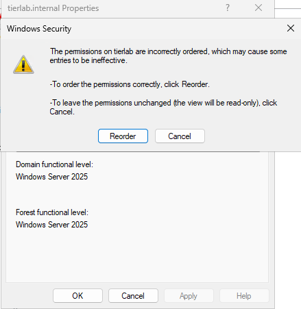
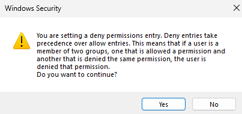

# Canonical ACLs — Fixing a Non-Canonical Domain Root

> **This page describes a deployment blocker.** If the Tier Model stopped
> with a message about a non-canonical ACL at the domain root, you are in the right
> place. Read this page fully before you touch anything in production.

---

## What is a non-canonical ACL, and why does the Tier Model refuse to continue?

Every Active Directory object carries a **Discretionary Access Control List (DACL)** —
an ordered list of Access Control Entries (ACEs) that determine who can do what to that
object. Windows defines a strict **canonical order** for those entries:

| Position | ACE type |
|----------|----------|
| 1st (top) | Explicit **Deny** |
| 2nd | Explicit **Allow** |
| 3rd | Inherited **Deny** |
| 4th (bottom) | Inherited **Allow** |

A DACL is **non-canonical** when that order is violated — specifically when an explicit
**Deny** appears *below* (after) an explicit **Allow**. Windows itself warns when it
detects this condition and marks some entries as ineffective.

The Tier Model delegates OU permissions at **Step 4** using the .NET
`DirectoryServices.ActiveDirectoryAccessRule` / `AddAccessRule` code path — the exact
same mechanism used internally by `New-TierModelOuAcl`. When the target object's DACL
is non-canonical, .NET throws:

```
System.InvalidOperationException:
This access control list is not in canonical form and therefore cannot be modified.
```

Because the domain root's ACL is **inherited by child OUs**, a non-canonical domain
root poisons the objects the Tier Model needs to delegate. Rather than partially apply
permissions and leave you with a broken, hard-to-diagnose configuration, the Tier
Model **hard-stops** with a clear message and points you here.

---

## Symptom

### From the Tier Model

When the Tier Model detects a non-canonical DACL at the domain root, deployment stops
with a message similar to:

> *"Non-canonical ACL detected at the root of the domain. The permissions are
> incorrectly ordered (an explicit Deny is applied after an Allow) and must be resolved
> before the Tier Model deployment can continue. First offending entry: '\<principal\>'."*

### From Windows itself

You can see the same condition without running any script. Open **Active Directory
Users and Computers** (with **Advanced Features** enabled), right-click the domain
root, choose **Properties**, and switch to the **Security** tab. If the DACL is
non-canonical, Windows immediately shows a dialog:



*Windows Security dialog on a domain root with a non-canonical ACL. The "Reorder"
button is the correct fix — but read the **Impact of reordering** section below before clicking it.*

---

## A concrete example: how ACLs become non-canonical

Consider `contoso.com` (`DC=contoso,DC=com`). Over several years, different teams
delegated rights directly at the **domain root** — itself an anti-pattern, but a
common one in long-lived domains.

**How it happened:**

1. Three years ago the help-desk team needed password-reset rights. A junior admin
   opened ADUC, right-clicked the domain root, and added an explicit **Allow** ACE
   for `CONTOSO\APAC_HelpDesk` (Reset Password on descendant User objects).
2. Last year the security team decided `CONTOSO\Global_HelpDesk` should be explicitly
   blocked from resetting passwords at the root. They used a PowerShell snippet that
   called `AddAccessRule` — which *appended* the new ACE to the end of the list.

The result: the Deny for `Global_HelpDesk` landed **below** the Allow for
`APAC_HelpDesk`. Non-canonical.

**Before (broken order):**

```
[1] ALLOW  CONTOSO\APAC_HelpDesk   — Reset Password (explicit)
[2] DENY   CONTOSO\Global_HelpDesk — Reset Password (explicit)  ← wrong: Deny below Allow
```

**After canonical reorder (correct order):**

```
[1] DENY   CONTOSO\Global_HelpDesk — Reset Password (explicit)  ← Deny first
[2] ALLOW  CONTOSO\APAC_HelpDesk   — Reset Password (explicit)
```

Windows cannot reliably enforce access when the order is wrong. In the broken order,
entry `[2]` (the Deny) may be **skipped or treated as ineffective** by some evaluators
— which is precisely why Windows flags it and why the Tier Model refuses to proceed.

---

## How to confirm and diagnose (PowerShell)

The snippet below mirrors the `New-TierModelOuAcl` code path exactly: it binds to the
target object, builds a harmless `GenericRead Allow` rule, and calls `AddAccessRule`.
On a non-canonical DACL it reproduces the `InvalidOperationException` without
committing any change.

If the TierModel module is available, run the supported check directly:

```powershell
Test-TierModelCanonicalAcl -PreferredDc <your-dc>
```

This returns whether the domain root DACL is canonical and names the first offending
entry. It is the same check the Tier Model runs automatically during prerequisites.

If the module is not yet installed, the module-free diagnostic snippet below exercises
the same `.NET` code path without any module dependency:

> **Note:** The snippet below is a diagnostic aid for confirming a non-canonical ACL condition, not a supported
> product cmdlet.

```powershell
[CmdletBinding()]
param(
    [Parameter(Mandatory)]
    [string]$TargetDN,

    [string]$Server = $env:COMPUTERNAME,

    [string]$Principal = 'Authenticated Users',

    [switch]$Commit
)

$ErrorActionPreference = 'Stop'

Write-Host ""
Write-Host "Tier Model OU ACL delegation repro (New-TierModelOuAcl code path)" -ForegroundColor Cyan
Write-Host "  Target    : $TargetDN"
Write-Host "  Server    : $Server"
Write-Host "  Principal : $Principal"
Write-Host "  Commit    : $($Commit.IsPresent)"
Write-Host ""

# Resolve the principal to a SID (same as the module does before building the rule)
try {
    $ntAccount = New-Object System.Security.Principal.NTAccount($Principal)
    $sid = $ntAccount.Translate([System.Security.Principal.SecurityIdentifier])
}
catch {
    Write-Host "Could not resolve principal '$Principal': $($_.Exception.Message)" -ForegroundColor Red
    return
}

# Bind exactly like New-TierModelOuAcl: LDAP://<server>/<dn>
$de = [ADSI]"LDAP://$Server/$TargetDN"
if (-not $de.Path) {
    Write-Host "Could not bind to LDAP://$Server/$TargetDN" -ForegroundColor Red
    return
}

# Build a harmless Allow rule (GenericRead) purely to exercise AddAccessRule
$adRights = [System.DirectoryServices.ActiveDirectoryRights]::GenericRead
$type     = [System.Security.AccessControl.AccessControlType]::Allow
$rule = New-Object System.DirectoryServices.ActiveDirectoryAccessRule($sid, $adRights, $type)

try {
    $acl = $de.ObjectSecurity          # same property the module uses
    $acl.AddAccessRule($rule)          # <-- throws here on non-canonical DACLs

    Write-Host "AddAccessRule SUCCEEDED - the target DACL is in canonical form." -ForegroundColor Green
    if ($Commit) {
        $de.ObjectSecurity = $acl
        $de.CommitChanges()
        Write-Host "Change committed (test ACE added for $Principal)." -ForegroundColor Yellow
    }
    else {
        Write-Host "No change committed (-Commit not supplied). This was attempt-only." -ForegroundColor Gray
    }
}
catch {
    Write-Host "AddAccessRule FAILED - the target DACL is not in canonical form." -ForegroundColor Red
    Write-Host ""
    Write-Host "  Exception : $($_.Exception.GetType().FullName)" -ForegroundColor Yellow
    Write-Host "  Message   : $($_.Exception.Message)" -ForegroundColor Yellow
    Write-Host ""
    Write-Host "  Open the domain root's Security tab in ADUC (Advanced Features on) to review" -ForegroundColor Gray
    Write-Host "  the ACE ordering and identify where a DENY sits below an ALLOW." -ForegroundColor Gray
}
Write-Host ""
```

**Usage against your domain root:**

```powershell
# Confirm the condition against the domain root — no changes made
.\Invoke-OuAclCanonicalRepro.ps1 -TargetDN 'DC=contoso,DC=com'

# Or target a specific OU that inherited the broken ACL
.\Invoke-OuAclCanonicalRepro.ps1 -TargetDN 'OU=Tier0,DC=contoso,DC=com'
```

If the output reads **"AddAccessRule FAILED — the target DACL is not in canonical form"**, your domain root
carries a non-canonical DACL and must be corrected before deploying the Tier Model.

---

## How to fix it — the Reorder button (recommended)

The **safest and officially-supported path** is the built-in **Reorder** button in
Active Directory Users and Computers.

### Before you proceed — back up first

> ⚠️ **Reordering an ACL is not easily reversible.** Once Windows rewrites the DACL
> in canonical order, there is no built-in undo. If the result is unexpected, your
> only recovery path is a restore from backup.
>
> **Take a full or system-state backup** of your domain controller(s) before
> touching the domain-root ACL. If your DCs are virtual machines, take a
> **snapshot or checkpoint** now. Do not skip this step.

---

## Impact of reordering — read this before you click

This is the most important part of this page. **Do not skip it.**

When a DACL is non-canonical, Windows marks some entries as *ineffective* — which
means certain Allow ACEs in the list may currently be **doing nothing**. After you
click Reorder, those previously-ineffective Allow ACEs will move into a position where
they are evaluated and will **actually take effect**.

> In short: **Reordering can expand effective permissions.** Rights that were silently
> blocked by the disordered ACL may suddenly be granted after the fix.

### What to do before you click Reorder

1. **Enumerate every explicit Allow ACE on the domain root.** In ADUC → Security tab
   → click **Advanced** to see the full list of explicit entries.
2. **Confirm each Allow is intentional.** Ask: *"Should this principal genuinely have
   this right on the domain root (and its descendants)?"*
3. **Remove any Allow ACE that should not be there** before you reorder. Once the ACL
   is canonical those entries will be active — remove them while they are still
   ineffective.
4. Only after cleaning up unwanted Allows: **click Reorder.**

### Back to the contoso.com example

In the broken state:
- `APAC_HelpDesk` has an explicit Allow at the root — currently its effective result
  depends on evaluation order, and with a non-canonical ACL some of that Allow may
  be ineffective.
- `Global_HelpDesk` has an explicit Deny — but because it sits *below* the Allow,
  Windows may be ignoring it.

After Reorder, the Deny for `Global_HelpDesk` moves above the Allow for
`APAC_HelpDesk`. This is correct canonical order. **The Deny will now reliably block
`Global_HelpDesk`.** The Allow for `APAC_HelpDesk` will now reliably grant those
rights.

If the Allow for `APAC_HelpDesk` is a legitimate, audited delegation — leave it in
place and reorder. If it was added by mistake years ago and no one has reviewed it —
**remove it first, then reorder.**

---

### Steps

1. Open **Active Directory Users and Computers** (`dsa.msc`).
2. From the **View** menu, enable **Advanced Features** (if not already on — you need
   this to see the Security tab on the domain root).
3. In the left pane, right-click your **domain root** (e.g. `contoso.com`) and choose
   **Properties**.
4. Select the **Security** tab. Windows immediately shows the "incorrectly ordered"
   dialog pictured in the [Symptom](#symptom) section above — click **Reorder**.
5. Back on the Security tab, click **Apply**.
6. Windows shows a deny-permissions confirmation dialog:

   

   *Windows confirms that Deny entries take precedence over Allow entries before
   applying the reordered DACL. Click **Yes** to continue.*

   > **This dialog restates exactly what the [Impact of reordering](#impact-of-reordering-read-this-before-you-click)
   > section above warns about.** Deny entries will now take precedence over Allow
   > entries — which is why you must review and remove any unintended Allow ACEs
   > *before* reaching this point. If you have not done that yet, click **No**, go
   > back, and complete the review first.

7. Click **OK** to close the Properties window.
8. The domain root DACL is now in canonical order. Re-open the Security tab (the
   "incorrectly ordered" dialog should no longer appear), or re-run the diagnostic
   snippet above, to confirm.

Windows has rewritten the DACL: explicit Deny entries are now at the top, followed by
explicit Allow entries, then inherited Deny, then inherited Allow.

---

## If you are unsure — get help

Altering the ACL on the domain root of a production Active Directory domain carries
real risk. If you are not confident in the specific ACEs present, what they grant, or
whether removing them is safe:

> **Open a support case with Microsoft** before making any changes. Microsoft Support
> can help you safely inventory and interpret the existing ACEs, identify which entries
> are safe to remove, and walk through the Reorder procedure with you. This is not a
> step to rush.

---

## Summary checklist

- [ ] Back up / snapshot all domain controllers.
- [ ] Open ADUC → Advanced Features → domain root → Properties → Security.
- [ ] Review every explicit Allow ACE. Remove any that are not intentional.
- [ ] Click **Reorder** and confirm.
- [ ] Re-run the diagnostic snippet above to verify the DACL is now canonical.
- [ ] Re-run the Tier Model deployment.
