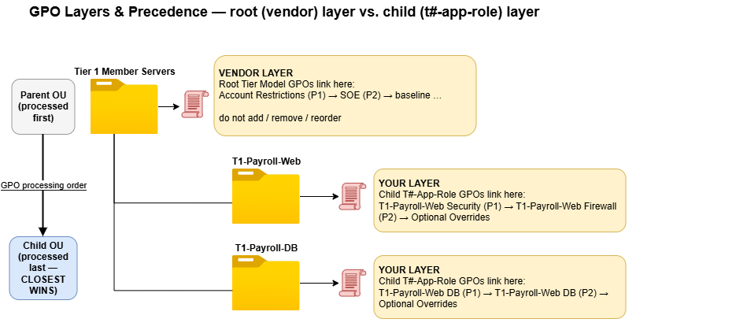
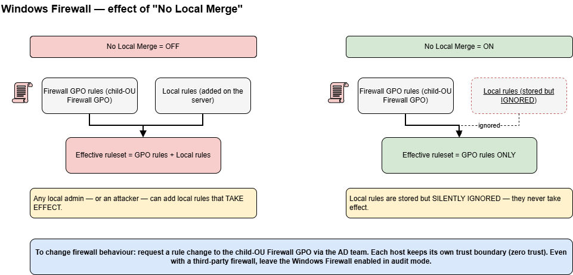
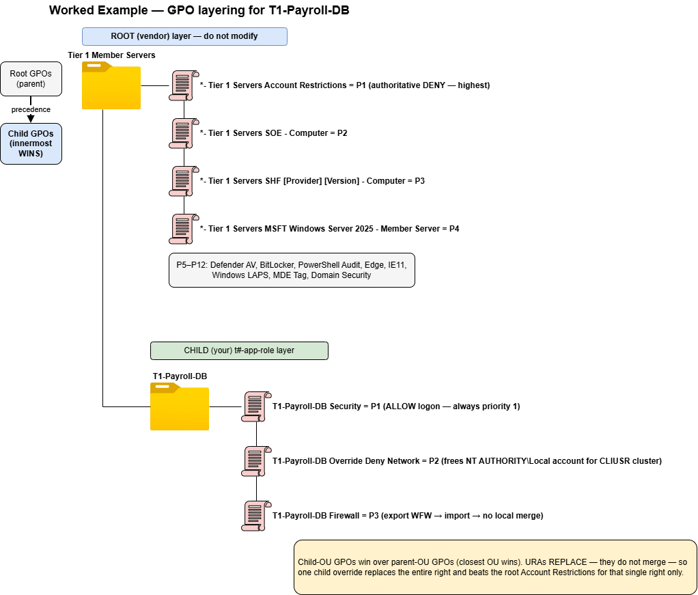

# GPO Management Guidance & Best Practices

This page defines the operational rules for managing Group Policy Objects within the Active Directory Tier Model. It is prescriptive by design. The goal is a black-and-white model that eliminates grey custom configurations, keeps in-place upgrades working, and keeps the audit script accurate.

**This page covers operational practice.** For the JSON schema used to declare GPOs (modes, `importPath`, `gpoStatus`, URA/RG properties), see [GPO Management Strategy](gpo-management-strategy.md).

---

## Contents

1. [Overview & Philosophy](#1-overview-philosophy)
2. [Enable the Account Restrictions GPO First](#2-enable-the-account-restrictions-gpo-first)
3. [The Golden Rules](#3-the-golden-rules)
4. [The GPO Layers & Precedence](#4-the-gpo-layers-precedence)
5. [Post-Deployment Configuration](#5-post-deployment-configuration)
6. [Choosing Your Security Baseline](#6-choosing-your-security-baseline)
7. [Windows Version Support](#7-windows-version-support)
8. [The SOE — Your Environment's Override Surface](#8-the-soe-your-environments-override-surface)
9. [Review Every Provided GPO — Use It or Leave It Unlinked](#9-review-every-provided-gpo-use-it-or-leave-it-unlinked)
10. [OU Design: Inheritance & Enforcement](#10-ou-design-inheritance-enforcement)
11. [Extending With Child OUs](#11-extending-with-child-ous)
12. [Migrating Applications In — Naming Convention](#12-migrating-applications-in-naming-convention)
13. [The Deny Model (User Rights)](#13-the-deny-model-user-rights)
14. [Template GPOs Reference](#14-template-gpos-reference)
15. [Windows Firewall Deep-Dive](#15-windows-firewall-deep-dive)
16. [Governance — Checks & Balances](#16-governance-checks-balances)
17. [Worked Example — Payroll (Web + DB)](#17-worked-example-payroll-web-db)
18. [Default Domain and Default Domain Controller Policies](#18-default-domain-and-default-domain-controller-policies)
19. [Ongoing Maintenance & In-Place Upgrades](#19-ongoing-maintenance-in-place-upgrades)
20. [Related Reading](#20-related-reading)

---

## 1. Overview & Philosophy

The Tier Model GPO set is a **vendor layer**. It is designed, tested, and version-controlled as a unit. When you deploy the Tier Model, the root Tier Model OU GPOs arrive pre-configured. They are not a starting point for customization — they are the finished product for their intended purpose.

This distinction matters for two reasons:

- **In-place upgrades.** When a new version of the Tier Model ships, it replaces root-level GPOs cleanly because those GPOs have not been modified. If you have altered them, an upgrade becomes a diff exercise and a maintenance burden you own forever.
- **Audit accuracy.** The [Drift Detection](drift-detection-details.md) audit script validates that the expected GPOs are present, linked in the correct order, and configured correctly. Reordering, renaming, or modifying a provided root-level GPO will produce drift findings that cannot be auto-remediated.

The **Account Restrictions GPO** (`*- Tier <N> Servers Account Restrictions`) is the GPO that makes the Tier Model work. It is linked at priority 1 (highest precedence) and is link-enabled from day one. It owns the Deny user rights assignments and the Restricted Group definitions for every server in the tier. Nothing you configure in other GPOs at the root level overrides it.

The **SOE GPO** (`*- Tier <N> Servers SOE - Computer`) is your designated override surface. It is linked at priority 2, so its settings override the security baseline and all other root-OU GPOs below it — but not the Account Restrictions GPO above it. The SOE ships link-disabled; enabling it is a deliberate post-deployment step. The SOE must never contain Deny user rights or Restricted Group definitions — those belong exclusively to the Account Restrictions GPO.

**Allow** logon rights for a specific application role belong at the child-OU level, in the app-role Security GPO — not in the SOE.

The model eliminates grey configurations by giving every setting a single, correct home:

- Deny logon rights and Restricted Groups for the tier → root Account Restrictions GPO (link order 1, enabled). **Hands off.**
- Settings that apply to all servers of a given tier (baseline overrides, update config, account renames) → SOE GPO (link order 2, you populate and enable this).
- Settings that apply to a specific application role → child-OU app-role Security GPO.
- Allow logon rights for an application role → child-OU app-role Security GPO.

If a setting does not fit one of these four homes, the question to ask is whether it belongs in the tier at all.

---

## 2. Enable the Account Restrictions GPO First

> **This is the single most important action after deployment. Do it first.**

The Tier Model ships a domain-root GPO named **`*- Tier Model Account Restrictions`**, linked at the root of the domain at link order 1. **It ships with its link disabled. Enable it as soon as your tier accounts and endpoints are in place.** Until it is enabled, the Tier Model's core containment guarantee is not in effect.

**What it does.** This GPO denies the Tier Model's privileged groups — the Tier 0, Tier 1, and Tier 2 admin, operator, service, and VPN groups, together with well-known privileged groups such as Domain Admins, Enterprise Admins, and Cert Publishers — the five "Deny log on" user rights on **every endpoint in the domain that sits outside the Tier Model OU structure**. In plain terms: it stops a tier account from being used anywhere it should not be.

**Why it applies "outside" the tiers.** The Tier Model OUs block inheritance (see [Section 10](#10-ou-design-inheritance-enforcement)), so this domain-root GPO does not reach the computers inside the tier OUs — those are governed by their own per-tier `*- Tier <N> Servers Account Restrictions` GPOs, which ship **enabled**. The domain-root GPO therefore covers everything the tier OUs do not: the default `Computers` container, legacy or not-yet-migrated servers, and any workstation OU outside the model. Together, the two layers contain tier accounts both **inside** the model (per-tier GPOs) and **outside** it (this domain-root GPO).

**Make sure it reaches every endpoint outside the model.** Linked at the domain root, this GPO flows by inheritance to every OU beneath it — but two conditions can stop it, both described later in this document (see [Section 10](#10-ou-design-inheritance-enforcement)). An OU with **Block Inheritance** will not receive the GPO unless it is linked **directly** to that OU. An OU that already has a GPO **linked and Enforced** with its own user-rights settings can override this GPO. Perform a thorough evaluation of every OU and GPO outside the Tier Model and confirm this GPO ends up at **priority 1** on all of those endpoints: link it directly wherever inheritance is blocked, and link it **Enforced** wherever an existing GPO would otherwise win. (That Enforcement is *outside* the Tier Model's own OUs and does not contradict the rule against enforcing within the model.) This is an area where experts from Microsoft or other vendors can help you quickly evaluate and plan which additional OUs need the GPO linked, and which need it linked and Enforced. The end goal is unambiguous: **every endpoint outside the Tier Model — client and server — receives this GPO**, so the built-in Tier Model groups and the well-known Tier 0 groups cannot log on to any non-Tier Model endpoint.

**Why it is safe for Domain Controllers.** The GPO's security filtering includes an explicit *Deny apply Group Policy* entry for **Domain Controllers** and **Read-only Domain Controllers**. This is a deliberate safety mechanism: even if the GPO were ever accidentally set to Enforced, it can never apply to a domain controller.

**Why this is critical.** Without this GPO enabled, a Tier 0 credential can still be used to log on to a Tier 2 workstation or an unmanaged legacy server. That single gap defeats the entire purpose of tiering — the containment of privileged credentials. Enabling it is what makes "a Tier 0 account only works on Tier 0 systems" actually true.

**Before you enable it.** Confirm your Tier 0 administrative accounts and management endpoints are correctly placed inside the Tier Model OUs, and account for any service account that legitimately operates outside the tiers. Then enable the link. The specific Deny user rights and the sanctioned per-application overrides are detailed in [Section 13](#13-the-deny-model-user-rights).

## 3. The Golden Rules

**Do:**

- Treat the Account Restrictions GPO as untouchable — it is the foundation of the model.
- Override in the SOE. The SOE is the only root-level GPO you add settings to.
- Build your application-specific configuration in child-OU Security GPOs.
- Pick exactly ONE security baseline — either the Microsoft SCT baseline or an SHF (CIS/NIST). Enable one, leave the other unlinked.
- Enable GPO links deliberately, after testing. Most root GPOs ship link-disabled for this reason.
- Remediate any Enforced GPOs at the root of the domain *before* deploying the Tier Model.
- Rename the SHF GPO to record the provider and version (e.g., `*- Tier 1 Servers SHF CIS v3.0.0 - Computer`) so future versions can be introduced and swapped without ambiguity.
- Use gMSA accounts for services wherever the vendor supports them.
- Deliver all third-party tool configuration via GPO in the SOE or a child-OU GPO — never leave it as an ungoverned local configuration.

**Never:**

- Add, remove, or reorder GPO links at the root of a Tier Model OU.
- Edit a provided root-level GPO directly. It is the vendor product.
- Link-enable both the Microsoft SCT baseline and an SHF baseline simultaneously. The duplicate setting processing degrades policy refresh performance.
- Use GPO Enforcement on any link within the Tier Model OUs.
- Use Block Inheritance on child OUs you create (it signals poor OU design — if you need to isolate a child OU, the correct answer is a different OU location or a more specific link).
- Add WMI filters to apply a GPO to one Windows version only.
- Create version-specific baselines (one for 2019, one for 2022, one for 2025). The Server 2025 baseline covers all.
- Put Deny user rights or Restricted Group definitions in the SOE.

---

## 4. The GPO Layers & Precedence

Group Policy applies from the outermost OU inward. Within an OU, a lower link-order number wins (link order 1 is highest precedence). The Tier Model uses this deliberately.

### Root Tier Model OU GPOs (the vendor layer)

These GPOs are linked directly on the root Tier Model OU (e.g., `OU=Tier 1 Member Servers`). They define the security posture for every server in that tier. Their link order is fixed and meaningful — link order 1 is highest precedence (wins):

| Link Order | Default State | GPO | Purpose |
|---|---|---|---|
| 1 | **Link-enabled** | `*- Tier <N> Servers Account Restrictions` | Authoritative DENY: all five Deny logon rights + Restricted Groups. Highest precedence. This is the GPO that makes the model work. |
| 2 | Link-disabled | `*- Tier <N> Servers SOE - Computer` | Your override surface. Overrides baselines and all GPOs below it — but NOT Account Restrictions above it. Enable after configuring. |
| 3 | Link-disabled | `*- Tier <N> Servers SHF [Provider] [Version] - Computer` | Industry-framework baseline slot (CIS, NIST, etc.). Enable this OR the MS SCT baseline — never both. |
| 4 | Link-disabled | `*- Tier <N> Servers MSFT Windows Server 2025 - Member Server` | Microsoft SCT baseline. Enable this OR the SHF slot — never both. |
| 5 | Link-disabled | Defender Antivirus | Microsoft Defender AV policy. |
| 6 | Link-disabled | BitLocker | BitLocker enforcement and recovery password escrow. |
| 7 | **Link-enabled** | PowerShell Auditing | Script block and module logging. Safe to enable from day one. |
| 8 | **Link-enabled** | Edge | Microsoft Edge browser policy. |
| 9 | **Link-enabled** | IE11 | Internet Explorer 11 policy. |
| 10 | Link-disabled | Windows LAPS | Built-in local Administrator password management. |
| 11 | Link-disabled | MDE Tier `<N>` Group Tag | Microsoft Defender for Endpoint onboarding tag. Requires MDE license. |
| 12 | **Link-enabled** | Domain Security | Domain-level security settings for member servers. This controls local account password policies on domain joined endpoints. |

The Account Restrictions GPO is enabled and effective from the moment you deploy the Tier Model. Every other GPO that could affect server connectivity or break running services ships disabled so you can enable it deliberately, after testing. Audit and logging GPOs (PowerShell Audit, Edge, IE11, Domain Security) ship enabled because they are safe to activate on any server with no service impact.

Because the Account Restrictions GPO is at priority 1, **nothing at the root-OU level overrides it** — not the SOE, not any baseline. The only layer that can override Account Restrictions settings is a child-OU GPO (because child OUs are processed after parent OUs and their settings win for that specific URA — see [User Rights Assignments Are Not Cumulative](#user-rights-assignments-are-not-cumulative) below).

### Child-OU App-Role GPOs (your layer)

GPOs linked on a child OU (e.g., `OU=T1-Payroll-Web,OU=Tier 1 Member Servers`) are processed *after* the parent-OU GPOs during inheritance, and child-OU settings win over parent-OU settings for any specific policy value. A setting configured in a child-OU GPO therefore overrides the same setting from any root Tier Model OU GPO — including the Account Restrictions GPO.

This is how the Deny logon rights are overridden for specific scenarios (see [Section 13](#13-the-deny-model-user-rights)): the root Account Restrictions GPO sets the Deny at the parent OU, and a child-OU Override GPO replaces that specific URA for the servers in the child OU. Understanding *why* this works requires understanding how URA precedence works — see the next subsection.



*The root Tier Model OUs are the vendor layer (do not modify); your application GPOs link at the child OUs, which are processed last and win for the settings they define.*

### User Rights Assignments Are Not Cumulative

This is one of the most historically misunderstood points in Group Policy — and it is fundamental to how the Tier Model's Deny override mechanism works.

For most GPO settings, if two GPOs configure the same value, the higher-precedence GPO wins and the other is ignored. User Rights Assignments (URAs) work differently: **a URA does not merge across GPOs — the GPO closest to the object (highest effective precedence) completely replaces the entire membership list for that right.**

Concretely: if the root Account Restrictions GPO sets `SeDenyBatchLogonRight` to deny a list of ten Tier Model groups, and a child-OU Override GPO also configures `SeDenyBatchLogonRight` with a shorter list that omits the built-in Administrators group, the child-OU GPO wins entirely. The effective deny list on servers in that child OU is the one defined by the child-OU GPO — not a union of both lists.

This is **why a sanctioned override works**: by re-declaring the full deny list minus the specific principal you need to exempt, the child-OU GPO replaces the root deny precisely and predictably. It is also why you must re-declare the complete intended list in any Override template you use — omitting a principal from the child-OU list removes it from the effective deny.

### GPO Configuration Halves — Why We Disable One Half per GPO

Every GPO contains two halves: **Computer Configuration** and **User Configuration**. Processing both halves on every refresh adds overhead regardless of whether each half contains any settings.

All Tier Model computer-OU GPOs ship with **User Configuration disabled** (`gpoStatus: UserSettingsDisabled`). This means the Windows client skips the User Configuration half entirely during Group Policy processing — reducing refresh time on every member server in the tier. When you duplicate a template GPO, confirm that User Configuration is still disabled in the copy before linking it.

A GPO should use both halves only in a deliberate **loopback processing** scenario, where computer policy is used to apply user-configuration settings to users logging on to specific computers. Loopback should be used sparingly — like Block Inheritance and Enforcement, it is a tool for exceptional cases, not a routine design pattern.

### Link-Enabled vs. Link-Disabled Defaults

The Tier Model ships GPOs in one of two states to enforce a deliberate review before you accept a potentially impactful setting:

**Ships link-DISABLED (review and enable after testing):**
- Security baseline GPOs (SOE, SHF, Microsoft SCT)
- Defender Antivirus
- BitLocker
- Windows LAPS
- MDE Group Tag
- Firewall Restrictions

**Ships link-ENABLED (active from deployment):**
- Advanced Audit
- PowerShell Audit
- Edge, IE11
- Account Restrictions (the five Deny GPO)
- PAW device GPOs (secure day one; AppLocker ships in Audit mode before Enforce)

The rationale: audit and logging are safe to enable immediately and should be on by default. Firewall and baseline GPOs can cause outages if applied to servers that have not been tested — so they require a deliberate decision to enable.

---

## 5. Post-Deployment Configuration

After deploying the Tier Model, perform these steps before considering deployment complete:

1. **Review which link-disabled GPOs apply to your environment.** Decide whether to use the Microsoft SCT baseline or an SHF baseline (not both — see [Section 6](#6-choosing-your-security-baseline)). Enable the one you choose.
2. **Configure and enable the SOE GPO link.** The SOE ships link-disabled. Populate it first (at minimum: local Administrator and Guest account renames, Windows Update settings), then enable the link. The SOE overwrites its settings over the baseline and all other root-OU GPOs — **except the Account Restrictions GPO at priority 1, which the SOE cannot override.**
3. **If your selected baseline enables the Windows Firewall in block mode**, add the firewall profiles to the SOE set to **Enabled + Audit mode** for all three profiles before enabling the baseline link. Audit mode logs dropped packets without blocking traffic, letting you identify what would break before committing to Block mode. See [Section 15](#15-windows-firewall-deep-dive) for the full procedure.
4. **Review the feature GPOs** (Defender AV, BitLocker, Windows LAPS, MDE Group Tag, Edge). For each, make the use-it-or-leave-it decision described in [Section 9](#9-review-every-provided-gpo-use-it-or-leave-it-unlinked).

This is the complete post-deployment checklist. Every other customization belongs in child-OU app-role GPOs, created as applications are migrated into the tier.

---

## 6. Choosing Your Security Baseline

You have two slots and you enable exactly one:

**Option A — Microsoft Security Compliance Toolkit (SCT) baseline**

The `*- Tier <N> Servers MSFT Windows Server 2025 - Member Server` GPO ships ready to link-enable. It is the Microsoft-recommended baseline for member servers. If your organization does not have a mandated industry framework, this is the correct choice. Link-enable it and move on.

**Option B — Security Hardening Framework (SHF): CIS, NIST, etc. **

If your organization requires CIS Benchmarks, NIST 800-53, or a similar framework, use the SHF slot. The requirement here is that the framework vendor **provides an importable GPO backup** — do not recreate a framework manually by cherry-picking settings. CIS members can download the CIS-provided GPO backup from the CIS website. NIST and other frameworks typically provide equivalent exports. If your framework vendor does not provide an importable GPO, contact them before proceeding.

1. Download the framework vendor's importable GPO backup.
2. Import it into the `*- Tier <N> Servers SHF [Provider] [Version] - Computer` GPO using `Import-GPO`.
3. Rename the GPO by replacing `[Provider]` and `[Version]` with the specific framework and version (e.g., `CIS v3.0.0`, or a date-based internal label such as `Nov26`). The full name becomes `*- Tier 1 Servers SHF CIS v3.0.0 - Computer`. This naming convention is the version-control mechanism — when a newer CIS version ships, you create a new GPO with the new version in the name and retire the old one without ambiguity.
4. Leave the Microsoft SCT baseline link-disabled.

**What if you do not have an importable GPO?** If your organization has selected CIS or NIST as its framework but does not have the official vendor-provided GPO backup, do not attempt to manually recreate the framework settings. Put those settings in the SOE instead, and disclose to your auditors that you are applying the settings individually rather than via the official vendor GPO. Importing the vendor's GPO and renaming the SHF slot means the baseline audits 100% to the vendor's recommendation; any deviation goes in the SOE with a documented reason. Manual recreation cannot make that claim.

**Why only one baseline?** It is not that running both produces unpredictable behavior — the higher-precedence GPO (the SOE, at link order 2) deterministically wins for any setting where both baselines differ. The real cost is **performance**: during every Group Policy refresh, the member server reprocesses every setting in every enabled GPO. Two baselines means hundreds or thousands of duplicate settings processed on every refresh interval across every server in the tier. Enable one baseline. Override specific settings in the SOE when needed. Apply application-specific overrides at the child-OU level when an application cannot comply with the baseline.

**Never modify a provided vendor baseline.** If your application or environment requires a baseline setting to be different, override that setting in the SOE. The SOE is at higher link priority and wins. The baseline remains unmodified and can be replaced cleanly when a new version ships.

**Never duplicate a setting across GPOs.** If Windows Update is configured in the SOE and also in the baseline, the SOE wins — but the duplicate makes it harder to understand your effective configuration and harder to audit. Never configure the same exact GPO setting in two places.

---

## 7. Windows Version Support

The `*- Tier <N> Servers MSFT Windows Server 2025 - Member Server` GPO applies correctly to servers running Windows Server 2016, 2019, 2022, and 2025. The settings it contains are supported on all of those operating system versions.

**Do not create separate baselines for each Windows Server version.** A GPO named `*- Tier 1 Servers MSFT Windows Server 2022 - Member Server` alongside the 2025 GPO, linked simultaneously, duplicates settings, creates precedence ambiguity, and adds a maintenance burden. The 2025 baseline is sufficient for all supported versions.

**Do not add WMI filters to apply a GPO only to a specific OS version.** WMI filters add processing overhead, complicate troubleshooting, and address a problem that does not exist here. A single baseline GPO applied to all servers in the tier is correct, intentional, and supported.

If a specific setting is needed only on a subset of servers (for example, a feature that exists on 2025 but not on 2019), that is a child-OU concern handled by placing those servers in their own child OU and applying the setting there.

---

## 8. The SOE — Your Environment's Override Surface

The Standard Operating Environment GPO (`*- Tier <N> Servers SOE - Computer`) is the one root-level GPO that you are expected to populate. It ships link-disabled and is linked at priority 2. When enabled, its settings override the security baseline and all other root-OU GPOs below it in link order. It does **not** override the Account Restrictions GPO at priority 1.

**Settings that belong in the SOE:**

- Local account renames: rename the built-in Administrator account and Guest account to your organization's standard names.
- Windows Update configuration (WSUS server, update schedules, deferral policies).
- Any setting your chosen baseline includes that you need to override for your environment.
- Any security or configuration setting your environment requires that is not covered by the chosen baseline.
- Inbound firewall rules needed on every server in the tier (e.g., a backup agent's listening port that every server requires).
- Trusted Offline Root and Enterprise Root PKI certificates and intermediary trusted chain certificates

**Settings that do not belong in the SOE:**

- Application-specific configuration (put it in a child-OU app-role GPO).
- Deny logon rights (those belong in the root Account Restrictions GPO, which you do not edit).
- Allow logon rights for a specific application (those belong in the child-OU app-role GPO).

---

## 9. Review Every Provided GPO — Use It or Leave It Unlinked

For each optional capability GPO, make a binary decision: use the provided GPO, or leave it unlinked and manage the capability yourself. The table below captures each decision.

> **Note:** All capabilities listed except MDE are **free, built-in** Windows features. These can help to meet baseline security and audit compliance out of the box using  enabling these GPOs. MDE requires a Microsoft Defender for Endpoint license.

| Capability | Provided GPO | If you use an alternative |
|---|---|---|
| **Disk encryption** | BitLocker GPO. Enforces BitLocker encryption and escrows the BitLocker recovery password to Active Directory. Link-enable if using BitLocker. | If a third-party disk encryption solution manages this, leave the BitLocker GPO unlinked. Deliver the third-party tool's configuration via the SOE or a child-OU GPO — not as an ungoverned local configuration. |
| **Local admin password** | Windows LAPS GPO. Manages the built-in local Administrator account password and stores it in Active Directory. Link-enable if using Windows LAPS. | If a separate password management solution manages the built-in Administrator account, leave the Windows LAPS GPO unlinked. |
| **Host firewall** | Firewall Restrictions GPO. Link-enable to enforce Windows Firewall rules centrally. | If a third-party host firewall agent is used, leave the Windows Firewall Restrictions GPO unlinked. Deliver that agent's configuration via the SOE or a child-OU GPO. **Do not disable the Windows Firewall.** Leave it running in audit mode (see [Section 15](#15-windows-firewall-deep-dive)). |
| **EDR / XDR** | MDE Group Tag GPO. Link-enable if servers are onboarded to Microsoft Defender for Endpoint. Requires MDE license. | If not using MDE, leave the tag GPO unlinked. Deliver your EDR agent's configuration via the SOE or a child-OU GPO — not as an ungoverned local configuration. |
| **Web browser** | Edge GPO. Edge is installed on every supported Windows Server version. Recommend link-enabling. | If Chrome or Firefox policies are required, add them to the SOE (or a child-OU GPO for specific servers). Edge and a third-party browser policy can coexist. |
| **Antivirus** | Defender Antivirus GPO. Link-enable if using Microsoft Defender Antivirus. Application-specific Defender AV exclusions (e.g., SQL Server data directories, IIS log paths) belong in the child-OU Security GPO for that role, not in the root-level Defender AV GPO. | If a third-party AV agent manages protection, leave the Defender AV GPO unlinked. Deliver the third-party agent's configuration via the SOE or a child-OU GPO — not as an ungoverned local configuration. |

---

## 10. OU Design: Inheritance & Enforcement

### Block Inheritance

Block Inheritance on an OU prevents GPOs from parent OUs from flowing into it. Within the Tier Model, Block Inheritance is used intentionally at Tier Model root OUs to isolate them from domain-level GPOs. You should not replicate this in the OUs you create beneath the Tier Model.

If you feel the need to block inheritance on a child OU, the correct diagnosis is usually one of:
- A setting in a root Tier Model GPO needs to be overridden — use the SOE or the Override template GPOs.
- A setting from a domain-level GPO is interfering — remediate the domain-level GPO instead of blocking inheritance (see the Enforced GPOs note below).

The only partial exception: you **may** block inheritance at the Domain Controllers OU to prevent domain-level GPOs from affecting domain controllers. This is operationally sound, but it is a production change with consequences — test it carefully. The Tier Model does not configure this by default because it is environment-specific.

### GPO Enforcement

An Enforced GPO link cannot be overridden by Block Inheritance or by a higher-priority link. Within the Tier Model, Enforcement is never used. If you Enforce a GPO on a Tier Model OU or its children, you create a layer that overrides the SOE and potentially the security baseline — breaking the precedence model this documentation describes.

Never enforce a GPO within the Tier Model OU structure.

### Enforced GPOs at the Root of the Domain

This is the most critical pre-deployment check. The Tier Model intentionally blocks GPO inheritance at its root OUs, which means standard domain-level GPOs (linked at the domain root without Enforcement) do not flow into the Tier Model. That is by design. The problem is GPOs that are **Enforced** — an Enforced link overrides Block Inheritance and flows into every OU in the domain regardless.

Any GPO that is link-Enforced at the root of the domain bleeds down into the Tier Model OUs and cannot be blocked. If such a GPO conflicts with a Tier Model GPO setting, the Enforced GPO wins — regardless of link order within the Tier Model.

**Before deploying the Tier Model, audit domain-level Enforced GPOs and remediate them.** Options:

1. Remove the Enforcement flag from the domain-level GPO link. This is the correct fix when Enforcement was applied as a shortcut rather than by design.
2. Move settings that must apply to the whole domain into the domain-level GPO without Enforcement, relying on normal inheritance where Block Inheritance does not apply.
3. Explicitly exclude the Tier Model OUs from the domain-level GPO's scope if its settings are not compatible with the Tier Model.

**Concrete check:** After deploying the Tier Model, open each Tier Model root OU in Active Directory Users and Computers, select the **Group Policy Inheritance** tab, and review which GPOs are applying. No GPO other than the Tier Model's own linked GPOs should appear on that list. Any unexpected entry is either a domain-level Enforced GPO or a GPO linked to a parent container — investigate and remediate before proceeding.

Do not proceed with Tier Model deployment while Enforced domain-level GPOs conflict with the Tier Model. The audit script will not report the root enforced GPOs as built drift auditing only review the GPOs linked at the OU level.

---

## 11. Extending With Child OUs

The root Tier Model OUs are the vendor layer: you do not modify the GPO structure there. All customer-specific, application-specific, or environment-specific configuration is built in child OUs beneath the root.

Child OUs serve several organizational purposes:

- **Application isolation:** Group all servers for a given application under a single child OU (e.g., `T1-Payroll`), and sub-OUs by role if needed (`T1-Payroll-Web`, `T1-Payroll-DB`).
- **Compliance or regional separation:** If a subset of servers must meet different compliance requirements (e.g., PCI-in-scope servers), place them in their own child OU and link the applicable additional GPOs there.
- **Simplified GPOs:** Rather than a single large SOE GPO that conditionally applies different settings, use separate child-OU GPOs that apply cleanly to the exact servers that need them. A Google Chrome policy GPO linked at a child OU is easier to audit and modify than a policy buried in a shared SOE.

The one rule when extending: do not replicate settings from root Tier Model GPOs in your child-OU GPOs. If you are duplicating a setting, you are either overriding it (in which case, use the Override templates) or adding unnecessary complexity.

---

## 12. Migrating Applications In — Naming Convention

When creating child OUs for application workloads, use the naming convention:

```
T#-<App>-<Role>
```

Examples:

- `T1-Payroll-Web` — Tier 1, Payroll application, web servers
- `T1-Payroll-DB` — Tier 1, Payroll application, database servers
- `T0-PKI-CA` — Tier 0, PKI application, certificate authority servers
- `T2-FileShare-FS` — Tier 2, file share application, file servers

Optionally, group application roles under a parent OU:

```
OU=T1-Payroll
    OU=T1-Payroll-Web
    OU=T1-Payroll-DB
```

Or place both roles directly under the tier root:

```
OU=T1-Payroll-Web, OU=Tier 1 Member Servers
OU=T1-Payroll-DB,  OU=Tier 1 Member Servers
```

Both structures work. Use the parent-OU grouping when you have several roles for one application and want them visually grouped in Active Directory Users and Computers. Use the flat structure for simpler applications.

GPO names at child OUs should follow the same `T#-<App>-<Role>` prefix to keep them associated with their OU. The primary Security GPO (containing URAs and Restricted Groups) follows the pattern `T1-Payroll-Web Security`. Additional GPOs for specific purposes use a descriptive suffix: `T1-Payroll-DB Firewall`, `T1-Payroll-DB Override Deny Network`.

---

## 13. The Deny Model (User Rights)

The Tier Model enforces five "Deny" logon rights at the root Tier Model OU via the `*- Tier <N> Servers Account Restrictions` GPO (link order 1, enabled). Each right denies the full set of Tier Model AD groups — Domain Admins, Cert Publishers, Tier 0/1/2 Admins/Operators/Service Accounts/VPN groups, and others as appropriate — plus the local Administrators/Administrator account(s) specific to that tier:

| Right | Denied To |
|---|---|
| Deny log on locally | Full set of Tier Model AD groups |
| Deny log on as a service | Full set of Tier Model AD groups + local Administrators group |
| Deny log on as a batch job | Full set of Tier Model AD groups + local Administrators group |
| Deny access to this computer from the network | Full set of Tier Model AD groups + `NT AUTHORITY\Local account` (all local accounts) |
| Deny log on through Remote Desktop Services | Full set of Tier Model AD groups |

The root Account Restrictions GPO defines the Deny side. **You do not modify this GPO.** The Tier Model owns the Deny.

Your child-OU app-role Security GPO owns the corresponding **Allow** logon rights. For example, a web server role Security GPO grants "Log on as a service" to the IIS application pool service account, and "Allow log on through Remote Desktop Services" to the Tier 1 local admins group.

Remember: URAs are not cumulative (see [User Rights Assignments Are Not Cumulative](#user-rights-assignments-are-not-cumulative)). When a child-OU Override GPO configures the same deny right, it replaces the entire deny list for that right on servers in that OU. The Override templates are designed for this: they ship with the full deny list except for the specific principal being exempted.

### Sanctioned Override 1: Built-in Administrators Running Services or Scheduled Tasks

The root GPO denies `Log on as a service` and `Log on as a batch job` to the local Administrators group. This prevents the common misconfiguration of running services or scheduled tasks as a local administrator account — a significant lateral movement risk.

Override this Deny when a vendor requires a member of the local Administrators group to run a service or scheduled task. To apply the override:

1. Duplicate `*- Tier Model Template Tier <N> Servers Account Restrictions - Override - Deny Service` (or `- Override - Deny Batch`).
2. Rename the copy to the child-OU naming convention: e.g., `T1-Payroll-DB Override Deny Service`.
3. Link the GPO at the child OU at **a link order below the child-OU Security GPO** — the Security GPO is always priority 1 at the child OU (it contains the Allow rights). The Override GPO at priority 2 or lower still beats the root Account Restrictions GPO for that one URA because child-OU GPOs outrank parent-OU GPOs.

### Sanctioned Override 2: Windows Failover Cluster and Local Account Network Access

The root GPO's "Deny access to this computer from the network" right is applied to `NT AUTHORITY\Local account` — the well-known SID that represents all local accounts on the computer. This is the correct default: local accounts should not authenticate over the network.

Windows Failover Clustering requires local account network access because the cluster service uses a local account (`CLIUSR`) for inter-node communication. The `*- Tier Model Template Tier <N> Servers Account Restrictions - Override - Deny Network` template removes `NT AUTHORITY\Local account` from the deny list — which frees **all local accounts** on the servers in that OU to access the network, not just `CLIUSR`. Use this override only where the application specifically requires it (Windows Failover Clustering being the primary case) and never on servers that are not cluster nodes.

To apply the override:

1. Duplicate `*- Tier Model Template Tier <N> Servers Account Restrictions - Override - Deny Network`.
2. Rename to the child-OU naming convention: e.g., `T1-Payroll-DB Override Deny Network`.
3. Link at the cluster nodes' child OU at a link order below the child-OU Security GPO (priority 1).

These are the **only two sanctioned overrides** of the Deny rights. Any other override requires a security review and must be documented.

---

## 14. Template GPOs Reference

The Tier Model ships the following template GPOs in `config/tiermodel-gpos.json`. Duplicate the relevant template GPO, rename it to your application-role naming convention, and link it at your child OU.

> **All template GPOs ship with User Configuration disabled.** When you duplicate a template, confirm the copy retains `gpoStatus: UserSettingsDisabled` before linking it. This keeps policy refresh efficient — the Windows client skips the unused half entirely.

| Template GPO | Purpose | How to use |
|---|---|---|
| `*- Tier Model Template Security Baseline - Computer` | Default Security policy applied at each child OU. Sets the local Administrators Restricted Group and grants Allow logon rights for the role. | Duplicate per child OU, rename to `T#-<App>-<Role> Security`. Add your `Tier <N> <App> Local Admins` group to the builtin Administrators Restricted Group. Link at priority 1 in the child OU. |
| `*- Tier Model Template IIS URA - Computer` | Security policy starting point for IIS web server roles. URA and Restricted Group for IIS. | Duplicate, rename (e.g., `T1-Payroll-Web Security`). Review and add IIS application pool service accounts. Add `Tier <N> <App> Local Admins` to the Restricted Group. Link at priority 1. |
| `*- Tier Model Template SQL URA - Computer` | Security policy starting point for SQL Server roles. URA and Restricted Group for SQL. | Duplicate, rename (e.g., `T1-Payroll-DB Security`). Add your SQL service account (gMSA preferred) to the Allow rights. Add `Tier <N> <App> Local Admins` to the Restricted Group. Link at priority 1. |
| `*- Tier Model Template IIS and SQL URA - Computer` | Combined IIS + SQL Security policy starting point for single-server environments. | IIS and SQL on the same server is not a security best practice. Use this template in test/dev environments only. Prefer the separate IIS and SQL templates in production. |
| `*- Tier Model Template Firewall Audit - Computer` | Windows Firewall policy starting point for an application role. | Duplicate, rename (e.g., `T1-Payroll-DB Firewall`). Follow the full procedure in [Section 15](#15-windows-firewall-deep-dive): enable block mode, export the server's firewall policy, import, set no local merge. |
| `*- Tier Model Template Tier <N> Servers Account Restrictions - Override - Deny Batch` | Overrides the root Deny: replaces the `SeDenyBatchLogonRight` URA for servers in this OU, removing the local Administrators group from the deny list. | Duplicate, rename (e.g., `T1-Payroll-DB Override Deny Batch`). Link at the child OU at priority **below** the child-OU Security GPO (priority 2+). Use sparingly; prefer gMSA service accounts. |
| `*- Tier Model Template Tier <N> Servers Account Restrictions - Override - Deny Network` | Overrides the root Deny: replaces `SeDenyNetworkLogonRight`, removing `NT AUTHORITY\Local account` (all local accounts) from the deny list. This frees all local accounts — not just CLIUSR — to access the network from servers in this OU. | Duplicate, rename (e.g., `T1-Payroll-DB Override Deny Network`). Link at the child OU at priority below the child-OU Security GPO. Use **only** where the application requires local account network access (Windows Failover Clustering). Never apply to non-cluster servers. |
| `*- Tier Model Template Tier <N> Servers Account Restrictions - Override - Deny Remote Desktop` | Overrides the root Deny for `SeDenyRemoteInteractiveLogonRight` for servers in this OU. | Duplicate, rename. Link below the child-OU Security GPO. Use only when a specific account requires RDP that the root deny explicitly blocks. |
| `*- Tier Model Template Tier <N> Servers Account Restrictions - Override - Deny Service` | Overrides the root Deny: replaces `SeDenyServiceLogonRight`, removing the local Administrators group from the deny list. | Duplicate, rename (e.g., `T1-Payroll-DB Override Deny Service`). Link at the child OU at priority below the child-OU Security GPO. Use sparingly; prefer gMSA. |

**Important note on Override templates:** The templates ship with the full deny list already defined minus the principal being exempted. Your starting point is already correct — do not add groups back unless you are intentionally expanding the exception beyond what the template provides.

---

## 15. Windows Firewall Deep-Dive

### Baseline Behavior

The Microsoft SCT baseline and all major SHF baselines (CIS, NIST) configure the Windows Firewall in **Block mode** — all inbound connections are denied unless explicitly permitted by a rule. If you are deploying the baseline to servers that currently run with the Windows Firewall disabled, enabling the baseline will break connectivity to those servers. Test first. Proceed slowly.

### Central Management Model

The Tier Model centrally manages the Windows Firewall through Group Policy. Each app-role GPO at a child OU controls the firewall rules for the servers in that role. This means:

- Rules needed on every server in the tier → SOE GPO.
- Rules needed on all web servers → child-OU web role GPO.
- Rules needed on all SQL servers → child-OU SQL role GPO.
- Rules unique to one application → that application's child-OU GPO.

### Building a Firewall GPO for an Application Role

1. **Confirm the Windows Firewall is enabled and in block mode on the server.** The baseline GPO (MS SCT or SHF) enforces block mode; if the server is already running under the baseline, this is already the case. If not, enable the Windows Firewall manually with block mode on all three profiles before proceeding — the goal is to centrally manage an already-enforced firewall, not to capture a permissive baseline.
2. Stand up one server for the application role and confirm it is operating normally under block mode.
3. Export the Windows Firewall policy from that server using `netsh advfirewall export`.
4. Import the exported policy into the Firewall Audit template GPO you duplicated for this role.
5. Enable the "Firewall: Do not allow users to manage the Windows Firewall" setting and set "Apply local firewall rules" to **No** (this is the "no local merge" configuration).
6. Set all three firewall profiles (Domain, Private, Public) to **Enabled** and **Audit** mode (log dropped packets but do not block yet).
7. Monitor the event log for blocked connections. Add rules for any legitimate traffic that is being dropped.
8. When no legitimate traffic is being dropped, switch the profiles from Audit to **Block**.

### "No Local Merge" — What It Means in Practice

When "Apply local firewall rules" is set to No, the Windows Firewall evaluates only rules delivered by Group Policy. Rules created locally — by a local administrator, by an installer, or by any other process — are present in the firewall's local store but are not evaluated.

This has one important security implication worth stating plainly: when "no local merge" is active, local rules are silently ignored — they exist in the local firewall store but are never evaluated. An attacker who has compromised a server cannot create a local firewall rule that takes effect. Any rule they add locally is ignored. The only way to change the effective firewall policy is to change the GPO — which requires requesting a rule change through the AD team, the same process as requesting a port to be opened on a network firewall.

Even when a third-party host firewall agent is deployed, keep the Windows Firewall enabled in audit mode. Audit mode logs dropped packets even when no blocking occurs. This provides a record of traffic that would have been blocked, which is valuable for forensics and for verifying that a future Block transition would not break legitimate traffic.



*With "no local merge" enabled, only the GPO's firewall rules are evaluated — local rules are stored but silently ignored, so changes must go through the child-OU Firewall GPO.*

---

## 16. Governance — Checks & Balances

A server owner or local administrator cannot self-modify the security controls that the Tier Model enforces. This is intentional.

- **Local Administrators membership** is controlled by the Restricted Group setting in the child-OU app-role GPO. A local administrator cannot add themselves or others to the Administrators group in a way that survives a Group Policy refresh. Changes to local Administrators membership must be requested to the AD team, who updates the `T#-<App>-<Role>` GPO if the request is valid.

- **User Rights Assignments** are set by the root Account Restrictions GPO and the child-OU Security GPO. A local administrator cannot grant themselves "Log on as a service" or remove themselves from a Deny right. The Group Policy refresh restores the GPO-defined configuration within the refresh interval.

- **Windows Firewall rules** (when "no local merge" is enabled) cannot be modified by local administrators in a way that affects the active ruleset. Rule changes must go through the AD team and the child-OU firewall GPO.

This model aligns with zero-trust principles: each host has its own trust boundary enforced by Group Policy, and the AD team is the authority for changes to that boundary. Server owners and application teams request changes; the AD team validates and implements them.

---

## 17. Worked Example — Payroll (Web + DB)

This example walks through building the complete GPO configuration for a two-tier Payroll application in Tier 1.

**Starting point:** Tier 1 Member Servers root OU, with all root Tier Model GPOs in place. Account Restrictions GPO (link order 1) is enabled and active. Security baseline (MS SCT or SHF) is chosen and link-enabled. SOE GPO is configured and enabled.

**Step 1 — Create child OUs**

Create `OU=T1-Payroll-Web,OU=Tier 1 Member Servers` and `OU=T1-Payroll-DB,OU=Tier 1 Member Servers`.

**Step 2 — Create the local admins group**

Create the AD security group `Tier 1 Payroll Local Admins` in the appropriate Tier 1 groups OU. Create this group *before* creating the GPOs that reference it. The GPO's Restricted Group setting resolves the group at policy application time, but creating it first ensures the reference is valid from the start.

**Step 3 — Web server Security GPO**

Duplicate `*- Tier Model Template IIS URA - Computer`. Rename the copy to `T1-Payroll-Web Security`. Link it to `T1-Payroll-Web` at **link order 1** (priority 1 in the child OU). In the Restricted Group for builtin Administrators, add `Tier 1 Payroll Local Admins`. Confirm User Configuration is disabled in the GPO properties.

**Step 4 — Database server Security GPO**

Duplicate `*- Tier Model Template SQL URA - Computer`. Rename the copy to `T1-Payroll-DB Security`. Link it to `T1-Payroll-DB` at **link order 1** (priority 1). In the Restricted Group for builtin Administrators, add `Tier 1 Payroll Local Admins`. Add your SQL service account (gMSA) to the "Log on as a service" Allow right. The gMSA still needs this Allow right explicitly granted — a gMSA does not bypass URA rules.

**Step 5 — Cluster node override (if Payroll DB uses Windows Failover Cluster)**

If the Payroll DB servers are Windows Failover Cluster nodes, the cluster service requires local account network access. The root Account Restrictions GPO denies `NT AUTHORITY\Local account` (all local accounts) from the network; this breaks cluster heartbeat.

1. Duplicate `*- Tier Model Template Tier 1 Servers Account Restrictions - Override - Deny Network`.
2. Rename the copy to `T1-Payroll-DB Override Deny Network`.
3. Link it to `T1-Payroll-DB` at **link order 2** (below the Security GPO at priority 1).

This Override GPO replaces the `SeDenyNetworkLogonRight` URA for servers in `T1-Payroll-DB`, removing `NT AUTHORITY\Local account` from the deny list. Because child-OU GPOs outrank parent-OU GPOs for URAs (and URAs replace, not merge), the Override GPO wins over the root Account Restrictions GPO for this one right — and the cluster's `CLIUSR` account, being a local account, is freed to communicate across cluster nodes.

**Step 6 — Firewall GPOs**

For each child OU:

1. Duplicate `*- Tier Model Template Firewall Audit - Computer`.
2. Rename: `T1-Payroll-Web Firewall` and `T1-Payroll-DB Firewall`.
3. Confirm the Windows Firewall is enabled in block mode on the representative server (the baseline GPO enforces this; verify it is effective before exporting).
4. Export the Windows Firewall policy from a representative server for each role using `netsh advfirewall export`.
5. Import the exported policy into the respective GPO.
6. Enable "no local merge" (set "Apply local firewall rules" to No on all three profiles).
7. Set all three profiles to Enabled + Audit mode.
8. Link each GPO to its respective child OU and enable the link.
9. Monitor for dropped legitimate traffic over several days, then transition to Block mode.



*GPO layering for the Payroll DB: root Tier Model GPOs (Account Restrictions at priority 1) plus the child-OU app-role GPOs; child-OU GPOs win over the parent, and each URA override replaces the entire right.*

**Result:** The Payroll Web servers accept IIS traffic with local admins managed by Restricted Group. The Payroll DB cluster nodes accept SQL traffic and allow cluster heartbeat via the local account network override. Both sets of servers have centrally-managed firewall rules. The AD team controls all of these settings — no server owner can self-modify them.

---

## 18. Default Domain and Default Domain Controller Policies

The two default policies — the **Default Domain Policy** and the **Default Domain Controller Policy** — require special handling. The Tier Model deliberately blocks the Default Domain Policy from reaching tier computers, and the guidance below explains how to keep both defaults healthy.

### A human should never edit the default policies

The wording is deliberate. **Solutions** may modify the defaults when it is a genuine product requirement, and that is acceptable:

- An Enterprise **AD CS / PKI** deployment adds its trusted root CA certificate to the Default Domain Policy so every client trusts the CA.
- **On-premises Exchange** modifies the Default Domain Controller Policy user rights so Exchange can read the domain controllers' security logs.

These application-driven changes are legitimate and expected. What should **not** happen is a **person** adding settings to these policies beyond their defaults.

**The one exception a human does change:** the domain **password, account-lockout, and Kerberos policy**. This must live in the Default Domain Policy, so changing those *existing* settings is correct. What you must not do is *add new, unrelated settings* — a screen-saver timeout, a mapped drive, a firewall rule — to the defaults. Change the settings that belong there; add nothing else.

### Why this matters for recovery (DSRM)

During an Active Directory **Directory Services Restore Mode (DSRM)** restore, **only the two default policies apply** — no other GPO is processed. If a GPO applied to the Domain Controllers OU had locked you out, and you had also modified the default policies, you can lock yourself out of the restore path itself. Keeping the defaults clean preserves your last line of recovery. This is not hypothetical — it happens.

### Do not add Denys to the Domain Controller user rights

Only the **Default Domain Controller Policy** should control the domain controllers' user rights assignments. Because the rule is "do not modify it," there is no need to add hardening or Deny entries there. If you choose to anyway, test your backups and confirm you have not locked yourself out first — but the strong recommendation is not to.

### Clean up the defaults

Over the years, settings accumulate in the default policies. Identify everything that has been added beyond the true defaults and **move each setting to the GPO where it belongs** — a baseline, the SHF, or the SOE — and return the defaults to their default state.

### Block Inheritance and the password policy

The Tier Model **blocks inheritance** at its OUs, which stops the Default Domain Policy from reaching tier computers. This is on purpose: in most environments the Default Domain Policy has been modified over time, and those settings were being applied to every computer in the domain.

One critical caveat: **the domain password and Kerberos policy still apply to all users.** Block Inheritance does **not** stop the password and Kerberos policy — those are enforced domain-wide, not through ordinary GPO inheritance. All domain accounts use the Default Domain Policy password settings unless overridden by a Fine-Grained Password Policy.

- **Fine-Grained Password Policies (FGPP).** FGPPs are a good fit for the Tier Model account and service-account OUs — for example, administrative accounts commonly require longer passwords than end users for compliance. The Tier Model does **not** ship FGPPs: password requirements are unique to each organization and are a compliance discussion for **after** deployment. Treat FGPP as recommended post-deployment guidance, not part of the model.
- **Trusted certificates.** Rather than relying on the Default Domain Policy's root-certificate modification (which Block Inheritance stops from reaching tier computers), add trusted certificates to the **SOE** GPOs throughout the Tier Model.
- **Domain Security baseline.** The lowest-priority policy in the Tier Model is the latest Microsoft SCT **Domain Security** settings. These apply to **local accounts on endpoints**, not to domain accounts. All domain accounts must use the Default Domain Policy password settings — or an FGPP override.

## 19. Ongoing Maintenance & In-Place Upgrades

### The Baseline GPO Upgrade Lifecycle

When a new version of a security baseline ships — a new Microsoft SCT release, a new annual CIS Benchmark, or a NIST revision — the upgrade process is:

1. **Create the new GPO.** Import the new baseline into a new GPO using the SHF naming convention with the updated version, for example: `*- Tier 1 Servers SHF CIS v3.0.0 - Computer` (or a date-based internal label such as `Nov26`). Do not modify the existing in-production GPO.
2. **Link at high priority, link-disabled.** Link the new GPO at the root Tier Model OU at a higher link priority than the current production baseline, but leave the link disabled.
3. **Scope to a pilot group.** In the GPO's Security Filtering, replace "Authenticated Users" with a security group containing a small set of test servers. Enable the link. The new baseline applies only to the pilot servers.
4. **Test.** Verify no services break, no connectivity issues emerge, and the pilot servers behave correctly under the new baseline. Address any conflicts in the SOE.
5. **Expand scope.** Change Security Filtering back to Authenticated Users. The new baseline now applies to all servers in the tier.
6. **Remove the old GPO.** Delete the link to the previous baseline GPO, then delete the GPO itself. The naming convention means there is no ambiguity about which GPO is current.

This is why baselines are version-controlled by name and never edited in place. A baseline GPO that is live in production has been tested against known-good behavior. Editing it in place changes the behavior of production servers without a controlled rollout. The replace-with-new approach gives you a pilot, a rollback path (re-enable the old GPO link), and a clean record of what changed and when.

### What Must Never Change at the Root Level

Once a root Tier Model GPO is deployed to production, it is immutable — with one exception. **The SOE GPO may be updated** because it is your configuration surface. All other root Tier Model GPOs — the Account Restrictions GPO, the baseline GPO, the feature GPOs — are either replaced wholesale (as described above) or left untouched between versions.

If you find yourself wanting to edit a root GPO that is not the SOE, the correct action is one of:
- Add the required setting to the SOE (for overrides).
- Use a child-OU Override template GPO (for Deny right exceptions).
- File a request with the Tier Model project if you believe the root GPO itself has an error.

Touching root GPOs breaks the in-place upgrade path: the next Tier Model version cannot cleanly replace a GPO you have modified. It also breaks the audit script, which validates exact expected configurations. The result is permanent manual maintenance — the model's primary cost is imposed on operators who modify root GPOs.

### Child-OU App-Role GPOs — Legitimate Change

Child-OU app-role GPOs are your environment's configuration and may legitimately change to support new requirements. A new application version that opens additional firewall ports, a gMSA rotation, a new service account — these changes go into the `T#-<App>-<Role>` GPO for the affected application role. This is expected and supported.

The distinction: root = vendor/immutable; child = yours/changeable.

---

## 20. Related Reading

- **[GPO Management Strategy](gpo-management-strategy.md)** — The JSON schema and mechanics for declaring GPOs in the Tier Model: modes (`create`, `createAndImport`, `createImportAndConfigure`), `importPath`, `gpoStatus`, and URA/RG properties. Read this if you need to understand how the deployment tool processes GPO declarations.
- **[Detailed Deployment Guide](detailed-deployment-guide.md)** — Step-by-step deployment walkthrough including the post-deployment checklist.
- **[Deployment Methodology](deployment-methodology.md)** — The overall deployment approach, idempotency principles, and validation framework.
- **[Drift Detection Details](drift-detection-details.md)** — How the audit script detects and reports GPO drift, and how to interpret findings. Drift findings that cannot be auto-remediated are typically caused by manual modifications to root Tier Model GPOs.

**Common questions this page answers:**

- *Do I need separate baseline GPOs for Windows Server 2019 and 2022?* No. See [Section 7](#7-windows-version-support).
- *Should I add WMI filters so the baseline applies only to specific OS versions?* No. See [Section 7](#7-windows-version-support).
- *Can I modify the provided Microsoft SCT or CIS baseline GPO?* No. Override in the SOE. See [Section 6](#6-choosing-your-security-baseline).
- *Why should I never use GPO Enforcement within the Tier Model?* See [Section 10](#10-ou-design-inheritance-enforcement).
- *Where do I put settings that apply to my whole tier?* The SOE. See [Section 8](#8-the-soe-your-environments-override-surface).
