# Sentinel Monitoring

> **The Active Directory Tier Model now has out-of-the-box Microsoft Sentinel monitoring — available today from the Azure Content Hub.** Install once, enable the analytic rules, deploy the automation rules, and save the workbook. Tier Model incidents are tagged, triaged, and visualized automatically.

---

## Why Tier Model monitoring

We are excited to finally offer out-of-the-box monitoring of the Tier Model as soon as it has been deployed. This has been a long-standing gap and is now filled with a Microsoft Sentinel solution available directly in the Content Hub.

This is by no means all possible monitoring. The design principle was deliberately simple and out-of-the-box: monitor the Tier Model with Microsoft Sentinel **without** requiring advanced or complex configuration. There are no custom playbooks or Logic Apps to build, no watchlists to populate and maintain.

### The non-negotiable requirement

**Every Domain Controller's Security event log must reach your Sentinel workspace.** Each DC keeps its own unique Security log. If even one DC is not onboarded, that DC is a blind spot — alerts that depend on events from that DC will never fire. Complete security insight requires every Domain Controller sending its Security logs to Sentinel (Windows Security Events via AMA, with a Data Collection Rule targeting the workspace).

### What this pack does NOT cover

This solution is Tier Model–specific. Operational monitoring — Domain Controller heartbeat, verifying that DCs are actually shipping their logs, AD replication health, AD service health — is **not** part of the Tier Model monitoring pack. Those are operational-monitoring concerns and should be addressed separately with dedicated tools.

This matters directly: a DC that stops sending logs silently undermines the "every DC must be covered" requirement above. Operational log-delivery monitoring is therefore a healthy companion to this pack, not a replacement for it.

---

## Before you begin

The following must be in place before installing the solution.

- **Tier Model deployed** — The Active Directory Tier Model must already be deployed and audited. See the [Detailed Deployment Guide](detailed-deployment-guide.md) and [Drift Detection](drift-detection-details.md).
- **AD auditing enabled** — Active Directory object auditing must be configured so the relevant Security events are generated. Use the helper script [`optional/Enable-TierModelAuditing.ps1`](https://github.com/microsoft/ActiveDirectoryTierModel/blob/main/optional/Enable-TierModelAuditing.ps1) in this repository to enable the required audit policy.

  > **Coming in a future release.** Enabling the required Active Directory object auditing will be built into the Tier Model deployment in a future feature release. Until then, run `optional/Enable-TierModelAuditing.ps1` manually.
  >
  > ⚠️ **Understand the impact before you increase auditing.** Additional auditing increases the volume of events written to each Domain Controller's Security event log. That log has a fixed size limit — if it fills faster than events are collected, the oldest events are overwritten and permanently lost. Before enabling extra auditing, make sure every Domain Controller's Security log is sized appropriately and is being forwarded to Sentinel promptly, so events are captured before they roll over. Overwritten events become exactly the blind spot described in [The non-negotiable requirement](#the-non-negotiable-requirement) above.

- **All DCs onboarded to Sentinel** — Every Domain Controller's Security logs must be flowing into the Sentinel workspace. Follow Microsoft's guidance for [Windows Security Events via AMA](https://learn.microsoft.com/azure/sentinel/data-connectors/windows-security-events-via-ama).

> ⚠️ **Do not rename the rules.**
>
> The analytic rules, automation rules, and workbook are tied together by rule names. Each analytic rule stamps its alert title with a `(TMxxx.1)` tag that the automation rules and workbook key off of. Renaming or modifying the default rule names breaks the automation rules and the workbook. Accept the shipped defaults.

---

## Step-by-step installation

### Step 1 — Install the solution from the Content Hub

Open **Microsoft Sentinel**, navigate to **Content Hub**, and search for **"Microsoft Active Directory Tier Model"**.

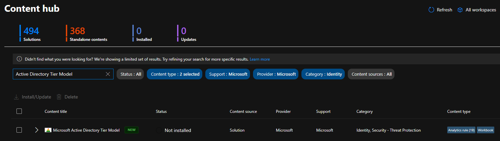

Open the solution to review its details.

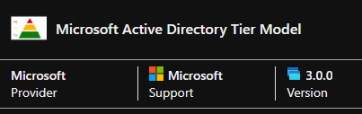

Click **Install**.

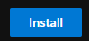

Wait for the installation to complete.

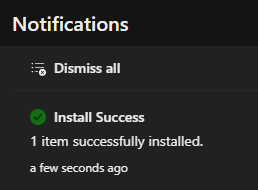

**Optional — confirm the templates landed:**

- Analytic rule templates: **Analytics → Rule templates**

  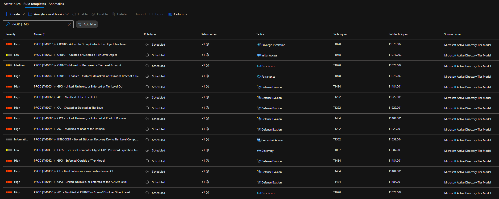

- Workbook template: **Workbooks → Templates**

  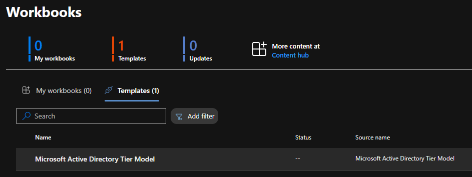

---

### Step 2 — Enable the analytic rules

This is the least automated step: each analytic rule must be created from its template, one at a time. There is no bulk-enable.

From a rule template, click **Create rule**.

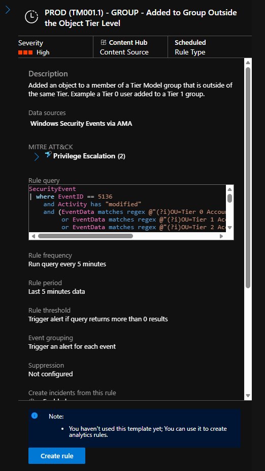

Walk the creation wizard, accepting the shipped defaults at each step:

**General**

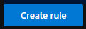

**Set rule logic**

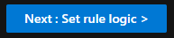

**Incident settings**

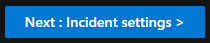

**Automated response**

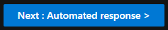

**Review + create**

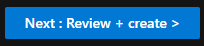

Click **Save** to create the rule.

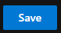

> **Reminder:** Keep the default rule name exactly as shipped. The `(TMxxx.1)` tag in the name is what the automation rules and workbook use to identify and route Tier Model incidents. Changing the name breaks that chain.

The rule appears under **Active rules**.

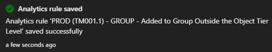

Repeat for every analytic rule template until all Tier Model analytic rules are enabled.

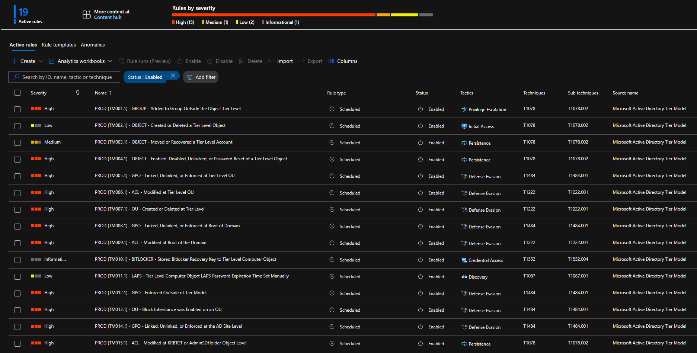

---

### Step 3 — Deploy the automation rules

The automation rules are **not** auto-created by the Content Hub install. They ship as a separate one-click ARM template that requires a small amount of input. Deploy them into the **same region** and the **same resource group** as your Microsoft Sentinel workspace to keep everything aligned.

Open the [automation rules readme](https://github.com/Azure/Azure-Sentinel/blob/master/Solutions/Microsoft%20Active%20Directory%20Tier%20Model/Playbooks/MicrosoftADTierModelAutomationRules/readme.md) and locate the **Deploy to Azure** button.

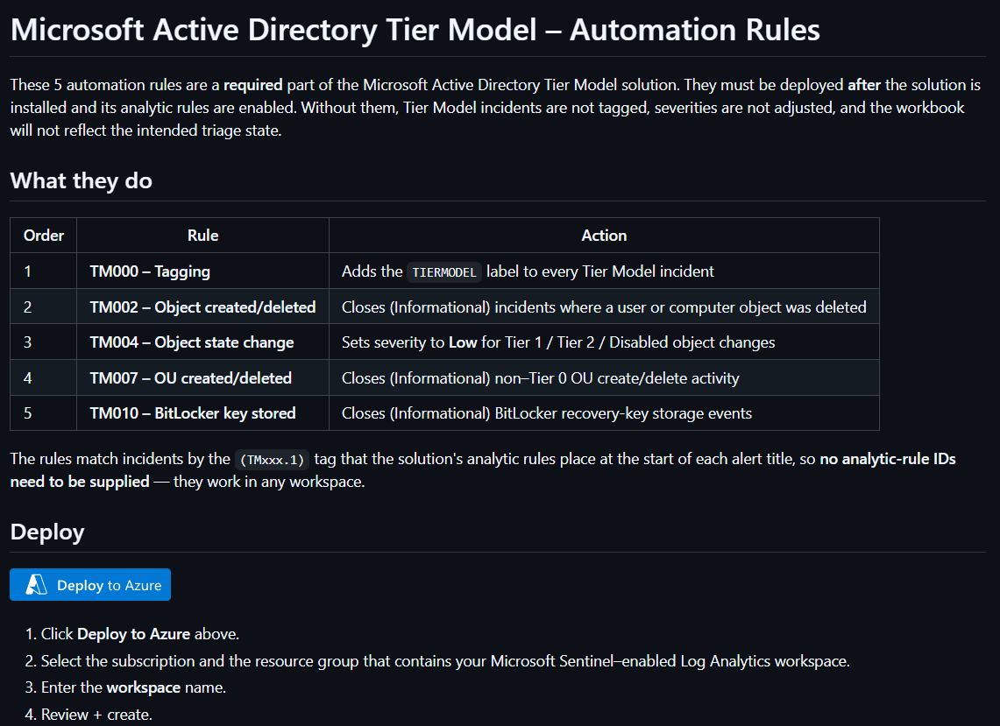

Click **Deploy to Azure**.

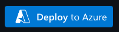

On the Custom deployment form, choose:

- **Subscription** — the subscription that contains your Sentinel workspace
- **Resource group** — the resource group that holds your Sentinel workspace
- **Region** — match the region of your Sentinel workspace
- **Workspace name** — the name of your Sentinel workspace

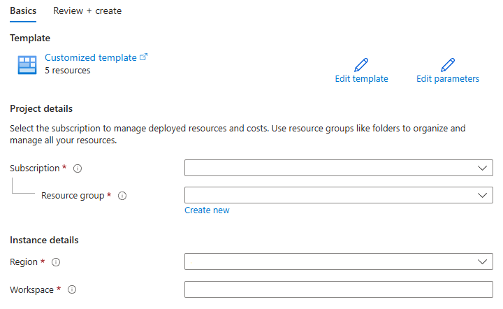

Click **Review + create**, then **Create**.

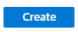

Wait for the deployment to succeed.

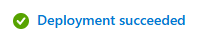

The automation rules now appear under **Microsoft Sentinel → Automation**.

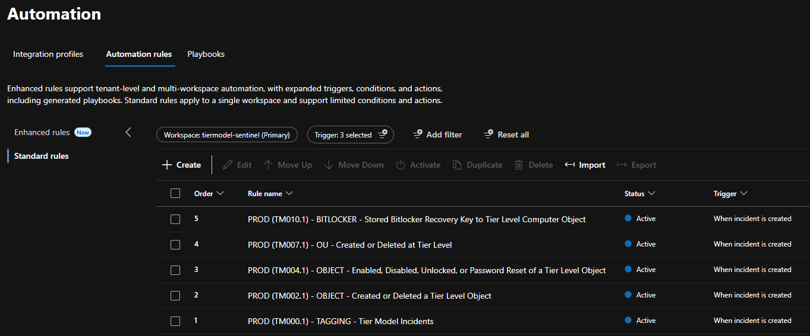

---

### Step 4 — Save the workbook

From **Workbooks → Templates**, open the Tier Model workbook and click **Save**.

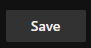

Choose the region to save the workbook into (match your Sentinel workspace region).

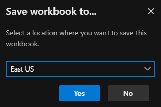

The workbook is saved.

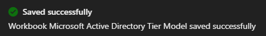

It now appears under **My workbooks**.

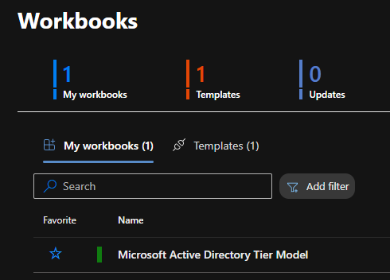

---

Once the analytic rules are enabled, the automation rules are deployed, and the workbook is saved, Tier Model incidents will be tagged, triaged, and visualized automatically.

---

## Contribute & links

### Source — where the KQL and definitions live

The solution content (KQL analytic rules, automation rules ARM template, workbook) is maintained in the public **Azure/Azure-Sentinel** repository:

- **Solution folder:** [Azure/Azure-Sentinel — Solutions/Microsoft Active Directory Tier Model](https://github.com/Azure/Azure-Sentinel/tree/master/Solutions/Microsoft%20Active%20Directory%20Tier%20Model)
- **Automation rules (Deploy to Azure + details):** [MicrosoftADTierModelAutomationRules readme](https://github.com/Azure/Azure-Sentinel/blob/master/Solutions/Microsoft%20Active%20Directory%20Tier%20Model/Playbooks/MicrosoftADTierModelAutomationRules/readme.md)

### Install source

In **Microsoft Sentinel → Content Hub**, search for **"Microsoft Active Directory Tier Model"** to find and install the solution.

### This project

- **Repository:** [github.com/microsoft/ActiveDirectoryTierModel](https://github.com/microsoft/ActiveDirectoryTierModel/)
- **Documentation:** [microsoft.github.io/ActiveDirectoryTierModel](https://microsoft.github.io/ActiveDirectoryTierModel/)

### Contributing

To propose a change or report an issue with the monitoring solution, raise a GitHub **issue** in **both** repositories:

1. [Azure/Azure-Sentinel](https://github.com/Azure/Azure-Sentinel) — where the solution content is maintained
2. [microsoft/ActiveDirectoryTierModel](https://github.com/microsoft/ActiveDirectoryTierModel) — so the Tier Model team has visibility

Open issues in both repositories **before** opening any pull request. This mirrors our issue-first policy and keeps both teams aligned.
